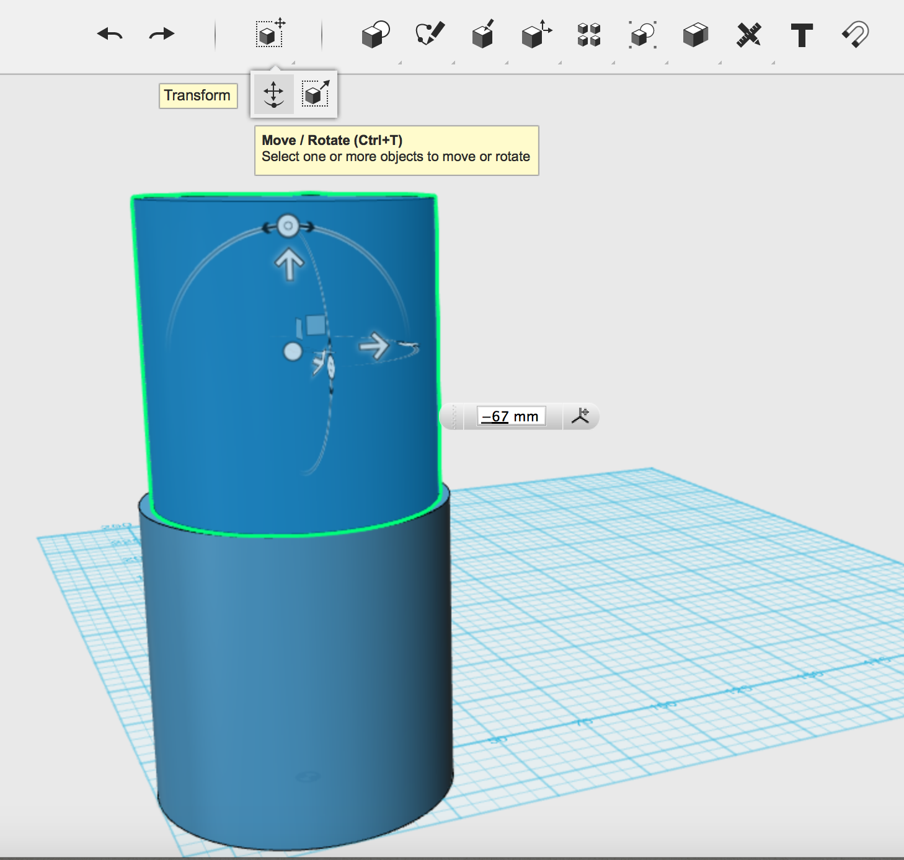
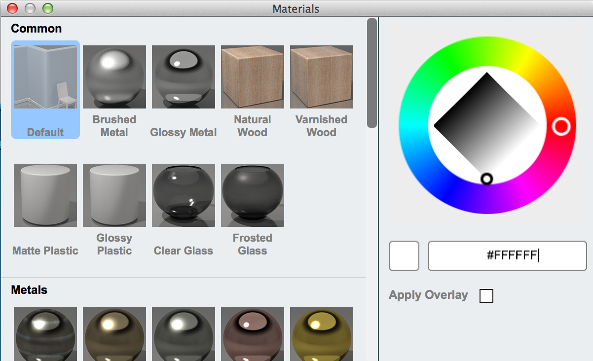
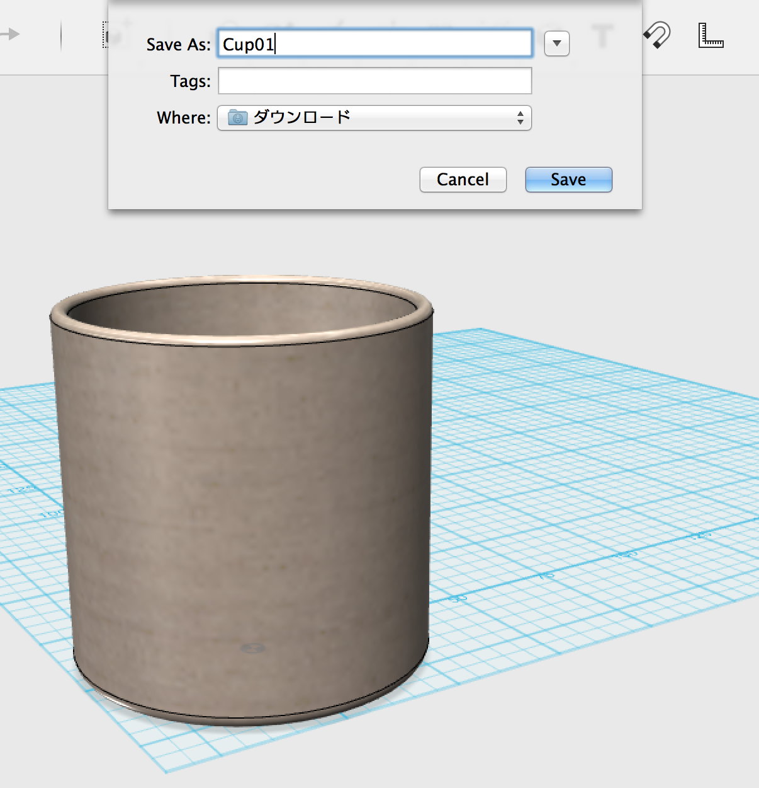

# １２３D Designで３Dのモデリングをしてみよう

## 環境設定

まず、下記のアドレンスにアクセスし、１２３Dをダウンロードし、インストールします。
http://www.123dapp.com/design
「Download 123D Design」をクリックします。
 

#### ◆Windowsの場合

32bitのWindowsの場合は「(1)Download for PC(32-bit)」、 
64bitのWindowsの場合は「(2)Download for PC(64-bit)」を
　選択します。

#### ◆Macの場合

「Download for Mac」を選択します。
 

選択するとダウンロードされますので、完了したらインストールを行います。
 

先ほどインストールした123D Designを起動します。
 

起動すると下のような画面が表示されます。
 

## コップをモデリングしよう

### 1.コップを作ろう。

完成イメージ
 

#### STEP1.円柱の配置

　メニューの[Primitives]→[Cylinder]を選択します。
 

  クリックする前に、画面下部のRadius(半径)に[35mm],Height(高さ)に[70mm]を指定します。
 

　値を入力後、クリックすることで円柱が配置されます。
 

#### STEP2.内部くり抜き用の円柱を作成

今回はコップの厚みを３mmにします。

中身をくり抜くように半径32mm、高さ67mmの円柱を作成します。
円柱の作成方法はSTEP1と同じです。
 

これで円柱が２個作成されました。
 

#### STEP3.内部くり抜き用の円柱を移動①

[Snap]コマンドを選択して、先に２番目に作成した円柱の上面をクリックし、
続いて最初に作成した容器の上面をクリックします。
 

２番目に作成した円柱が、最初に作成した円柱の上に配置されました。
 

#### STEP4.グループ化の解除

[Snap]コマンドで物体をくっつけると、自動的にそれらがグループ化されるので、
ここで、グループ化を解除します。

[Groupig]→[Ungroup]を選択し、２つの円柱の任意の箇所をクリックします。
これでグループ化は解除されます。
 

#### STEP5.内部くり抜き用の円柱を移動②

上部のくり抜き用の円柱を67mm下に移動し、コップの中に埋めます。
[Transform]→[Move]を選択して、上部の円柱を選択し、表示される
ダイアログを[-67mm]と入力します。
 

これで上部の円柱がコップの中に移動します。
 

#### STEP6.コップの内部くり抜き

コップ本体から内側のくり抜き用の円柱を引き算することで中をくり抜きます。
[Combine]→[Subtract]コマンドを選択します。
続いて、先にコップ本体をクリックし、くり抜き用の円柱をクリックします。
 

右図のように２つの円柱を選択したら、Enterキー(Macでは、Return)を押して
コマンドを実行します。
 

#### STEP7.仕上げ

最後にコップの周囲の角を丸めます。
[Modify]→[Fillet]を選択します。
 

コップの上部の外側の淵をクリックし、ダイアログが表示されるので、R値[1.5mm]に指定します。
同様に内側の淵もクリックし、R値[1.5mm]に指定します。
 

同様にコップの底の外側をクリックし、R値[3mm]に指定します。
 

#### STEP8.素材設定

最後にMaterialを選択します。
 

色々なものがありますので、お好みの物を選択してみて下さい。
 

選択した素材で作成したように表示されます。
 

## データ出力

３Dプリンターで出力するためにSTLファイルを作成します。

メニューより、[Export STL]を選択します。
 

その後表示されるウィンドウで[fine]を選択した状態でOKを押し、ファイル名を入力して[save]を選択します。
 

これでデータの作成は完了です。