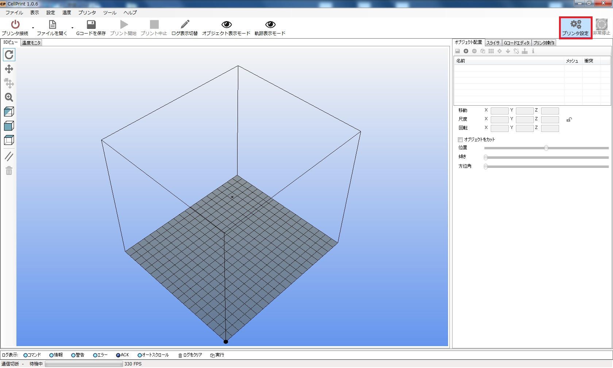
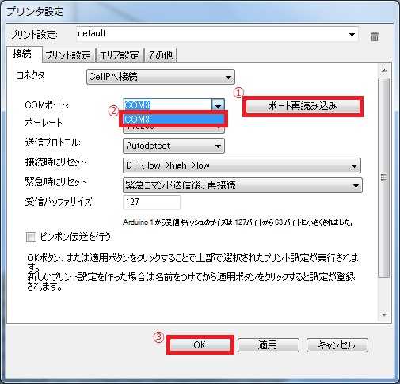
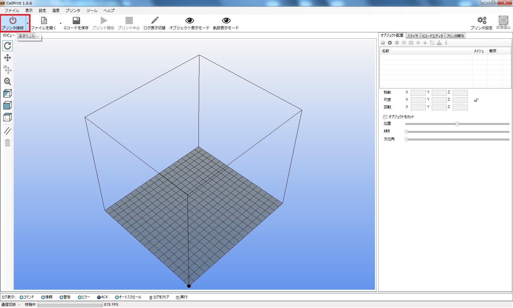
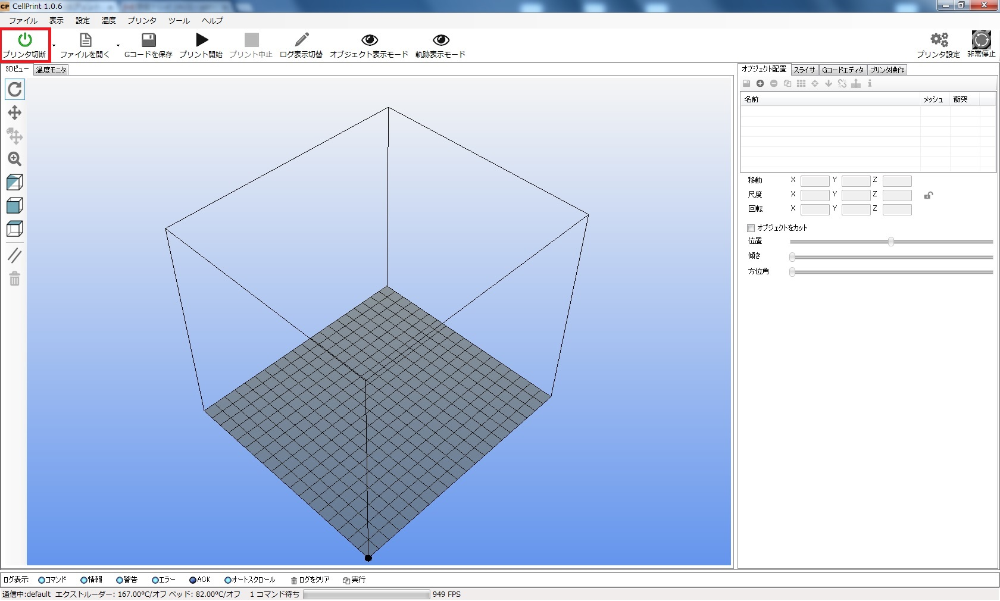
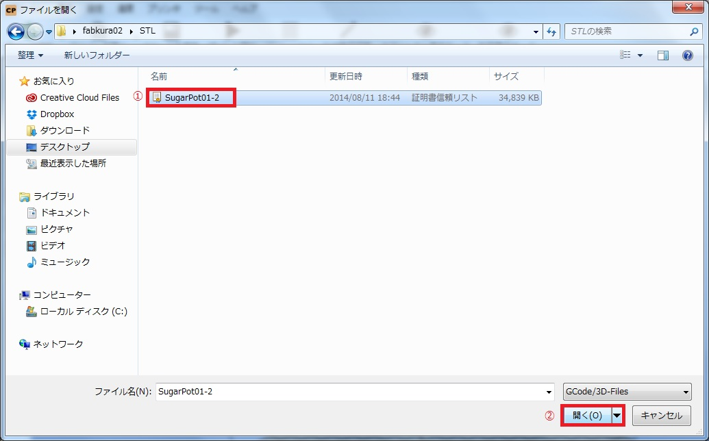
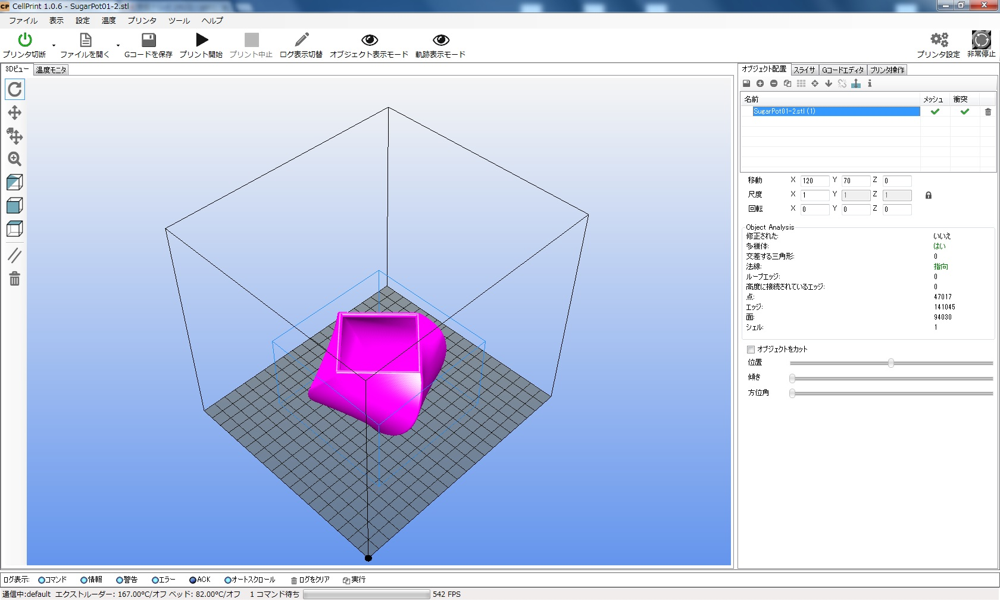
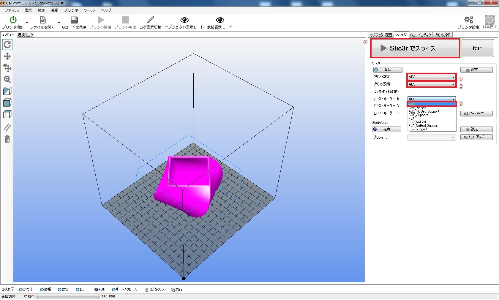
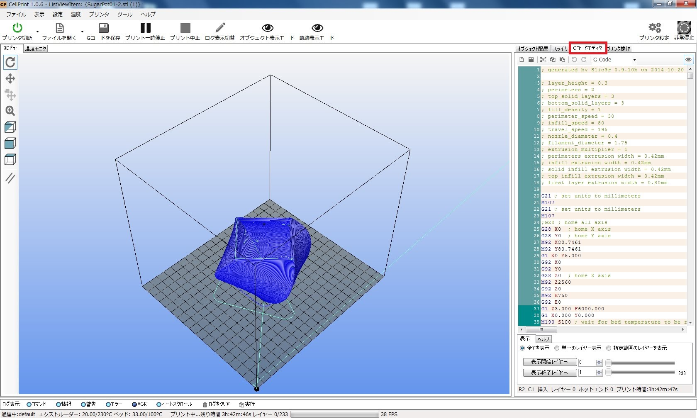
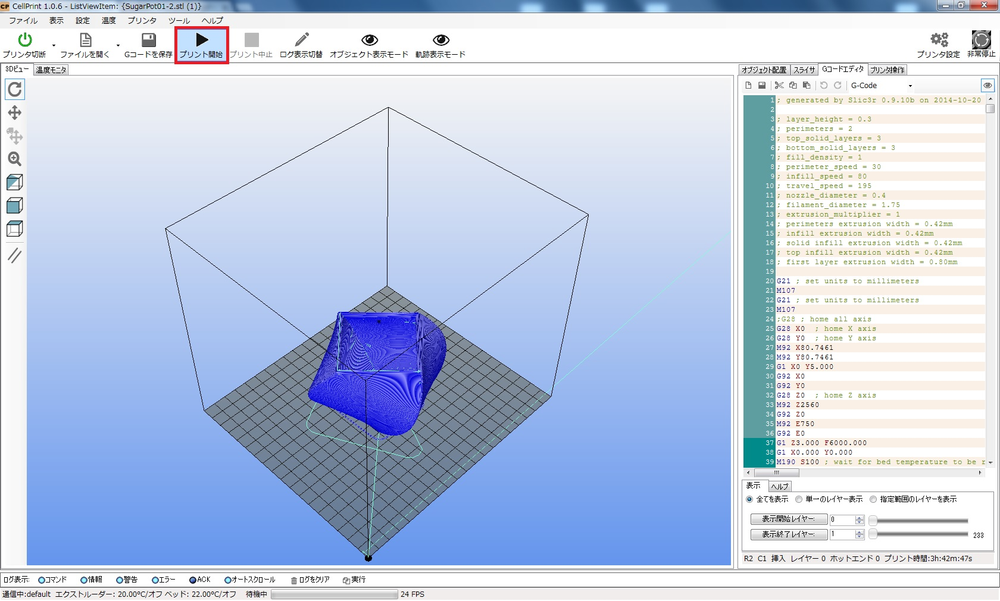

# CellPで３Dプリントしよう

### 1．環境設定（初回のみ設定）

プリント設定をクリックする

ポートを設定する

プリンタ設定ウィンドウが開いたら、①ポート再読み込みをクリックし、②プルダウンメニューから３Dプリンターを接続して表示されたポート番号を選択し、③OKボタンをクリックする。
 

### 2．プリンタを接続する

プリンタ接続をクリックする。
 

アイコンが緑、ボタンのボタン名が「プリンタ切断」になる。
 

### 3．STLファイルを開く
ファイルを開くをクリックする。
 

①STLファイルを選択し、②開くをクリックする。
 

 

### 4．STLファイルをスライスする
スライスの設定
①プリント設定、②プリンタ設定、③エクストルーダー１を【ABS】※に設定する。

※フィラメントがPLAの場合は、PLA_NoBedを設定する。

３Dオブジェクトをスライスする
 
④Slic3rでスライスするをクリックする
 

Ｇコードエディタタブを開いて、３Dオブジェクトが青くなったら、スライスが完了です。
 

### 5．３Dプリントする
上のツールバーより「プリント開始」をクリックします。
 

