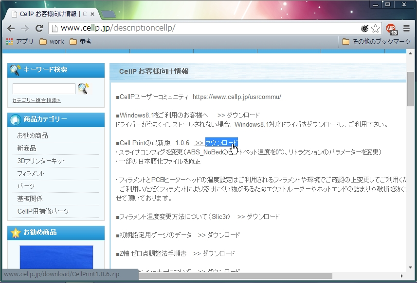
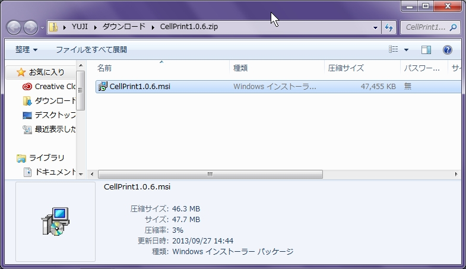
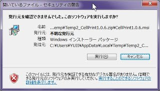
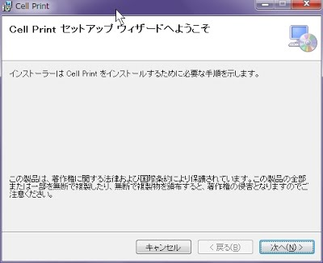
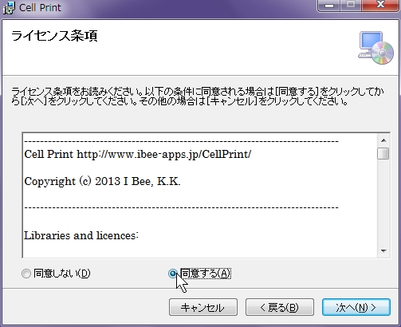
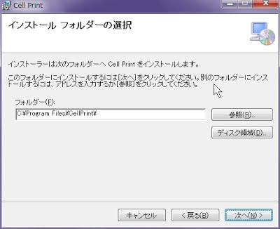
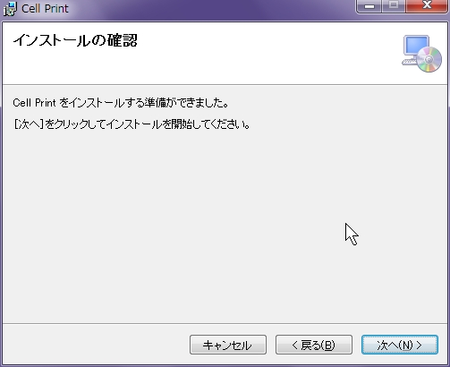
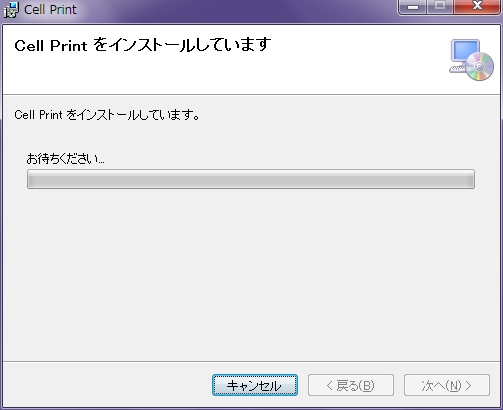

# CellPで３Dプリントしよう

以下のサイトより3Dデータ出力ソフトのCellPrintをダウンロードします。
CellPrintはWindows専用となっています。

http://www.cellp.jp/descriptioncellp/

最新版のバージョンは1.0.6になります。
 

CellPrint1.0.6.zipをクリックする。
 

※セキュリティの警告のウィンドウが表示された場合
実行(R)をクリックする。
 

次へ(N)＞をクリックする。
 

ライセンス条項に同意する(A)をクリックする。
 

インストールフォルダの選択で「次へ(N)＞」をクリックする。
 

インストールの確認で「次へ(N)＞」をクリックする。
 

インストールが完了したら、「閉じる(C)」をクリックする。
 

