メンテナンスについて説明します。

１. レール

レールの汚れは、部品の摩耗や、軸ズレに繋がります。
アルコール入りのウェットティッシュなどで行うとより効果的です。

レールは上側と下側の両方行います。

上側
 
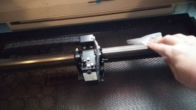

下側

 
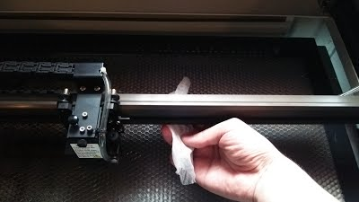

２. ヘッドのロール

ヘッドの横についているロール部分ににウェットティッシュをあて、矢印方向へ
ヘッドを移動させます。
反対側も同様に行います。
ヘッドのロールはレールの上下左右、合計4カ所あります。

 
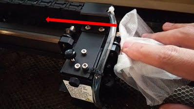

３. オートフォーカスのピン

付け根の辺りを念入りに磨きます。
 
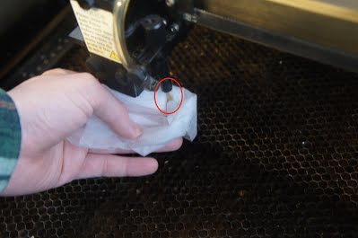

４. テーブル

ハニカムを取り外してテーブルに落ちた破片や汚れを掃除します。
この時、ハニカムを取り出し易くする為にテーブルを下げ、画像にあるようにハニカムのネジ2カ所を取り外します。

 
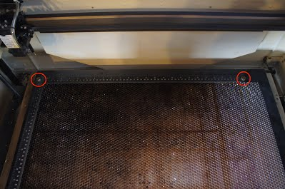

ハニカムの左下にあるプレートは、エンドスイッチを押す為のパーツです。
こちらも取り外します。
これが無いとレーザーカッターが壊れる原因になるので掃除が終わったら、必ず戻して下さい。
 
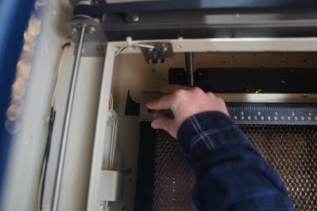
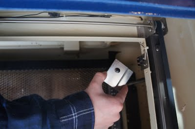

ハニカムを取り出す時は、レーザー照射装置に当たらない様に気をつけて取り出して下さい。
 
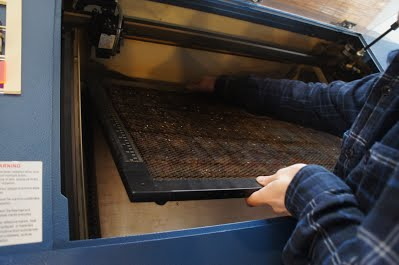
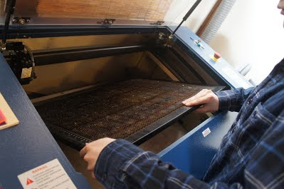
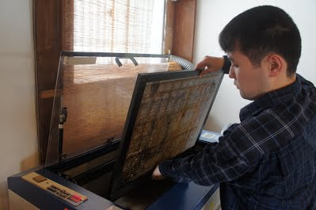

掃除機を使用して、落ちた破片などを掃除します。
 
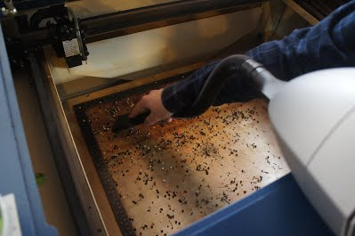

破片を取り除いたら、ウェットティッシュでテーブルを最低一回は磨いて下さい。
終わったらハニカムを戻してレーザーカッター内部の掃除は終了です。
 
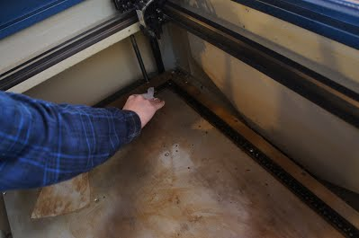

５. コンプレッサ

奥側にあるオレンジ部分を外します。
 
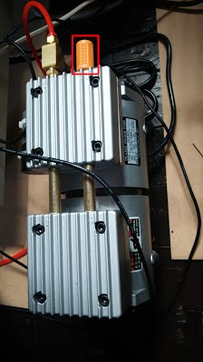

反時計回りに回すと外れます。
 
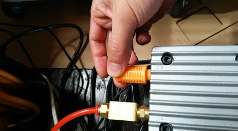

取り外したらブラシを使って水洗いし、綺麗になったら再度取り付けます。
 
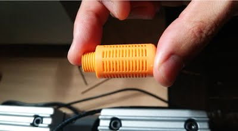

６. 集塵機

上の４方についている留め具を外します。
 
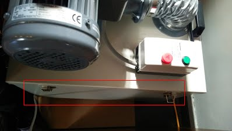

左右にある取っ手部分を持ち、上へあげるとフィルターがでてきます。
これを取り出し、水洗い等で綺麗にします。

 
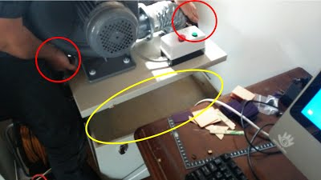
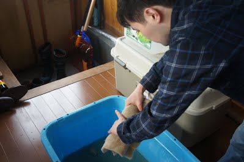

集塵機の排出口を掃除します。
背後からホースが伸びている四角いプレート部分の外側のネジ8カ所を外します。

 
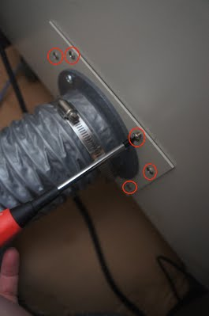

ネジを外したら、引き出しのように取り出し排出口の網をウェットティッシュで磨きます。

 
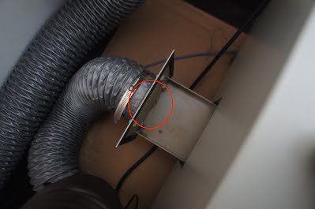

穴が塞がっている場合はブラシを使い、汚れを落とします。
 
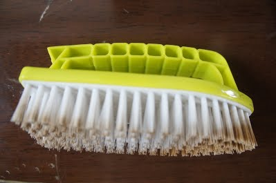

