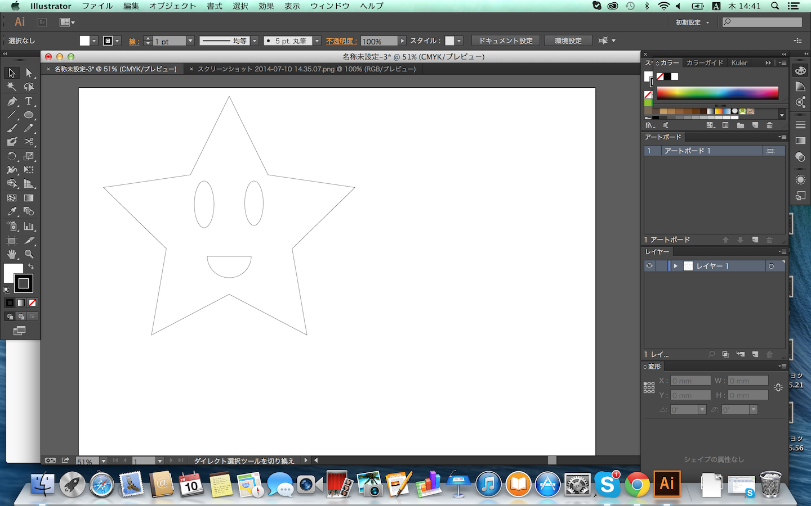

 

## イラストテーター ヒトデを描画してみよう
Illustratorでヒトデを書いていきましょう。

下の図にある赤枠は、図形を描画してくれる図形ツールです。
最初は長方形ツールという四角形を描画するツールになっています。

クリック長押しで、四角以外の図形ツールを選択することができます。今回はスターツールを選択します。

スターツールを選択したら、アートボードに図形を描きます。

次に、楕円形ツールを選択、ヒトデの目を描きます。

口を作成します。
目と同じく楕円形ツールで口を描きます。

口の形を整えましょう。
図の赤枠、「ダイレクト選択ツール」を選択します。

ダイレクト選択ツールを選択したらアンカーポイントと呼ばれる点を選択する事ができます。
アンカーポイントとは線と線をつなぐ点のことです。

口の円、一番上のアンカーポイントを選択します。

アンカーポイントを選択したらキーボードの「delete」、もしくはIllustratorメニューの「編集」ー「カット」でアンカーを削除します。

アンカーを削除するとアンカーと繋がっていた点と線が消えます。
「ペンツール」を使って線の連結を行います。

ヒトデ完成

次へ　STEP3. レーザーカッター切断用にデータを設定しよう