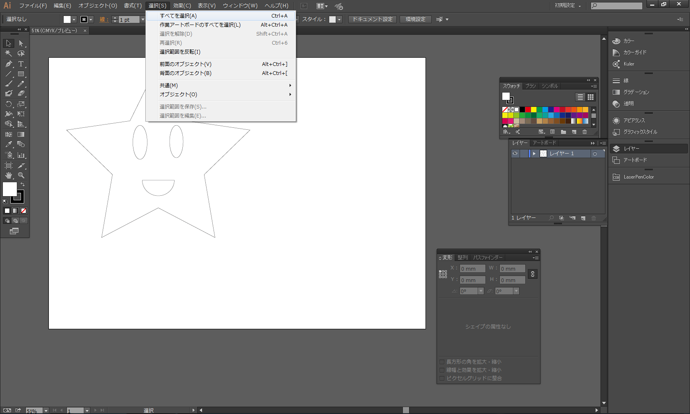
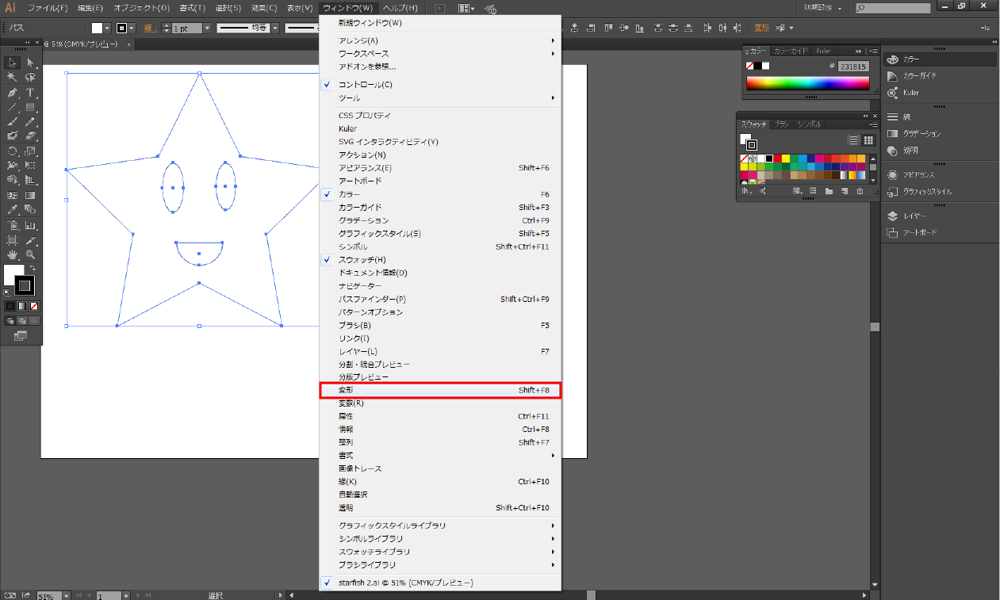
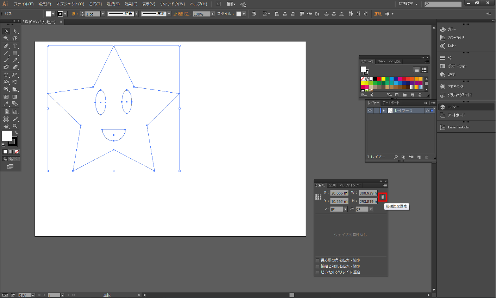
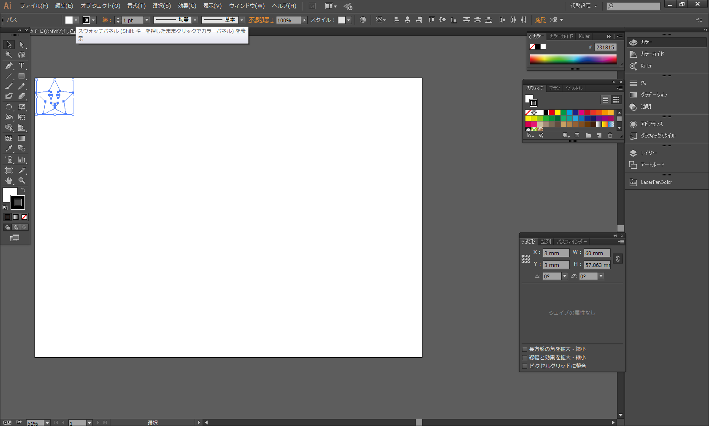
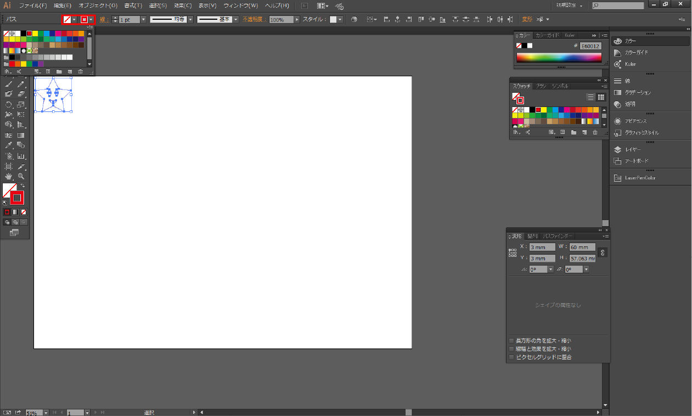
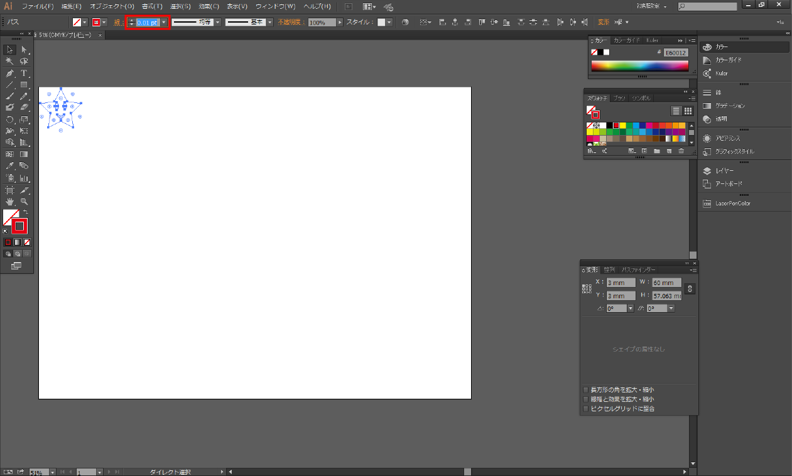

# レーザーカッター切断用にデータを設定しよう

先ほど作ったヒトデを実際にレーザーカッターで切断できる様に設定します。

Illustratorメニューから「選択」ー「すべてを選択」を選択します。
 

サイズの調整を行います。
Illustratorメニューの「ウィンドウ」ー「変形」を選択します。
 

変形の項目にある「縦横比の固定」を選択
次に項目の「W」を[60mm]にします。
 

幅が60mmになり、高さも幅に合わせて自動で縮尺が設定されます。
また「変形」の「X」、「Y」の数値を変える事で図の配置を任意の場所へと移動することが出来ます。
 

スウォッチパネルを設定します。
2ヶ所あるうちの左側を無し（〼）、右側を[赤]に設定します。
 

線幅の設定を[0.01pt]に設定します。
線幅を[0.01pt]に設定することで、素材のカットを行うという命令になります。
 

以上で設定終了です。

次へ　STEP4. 画像の形にくり抜きと彫刻用の画像を用意しよう