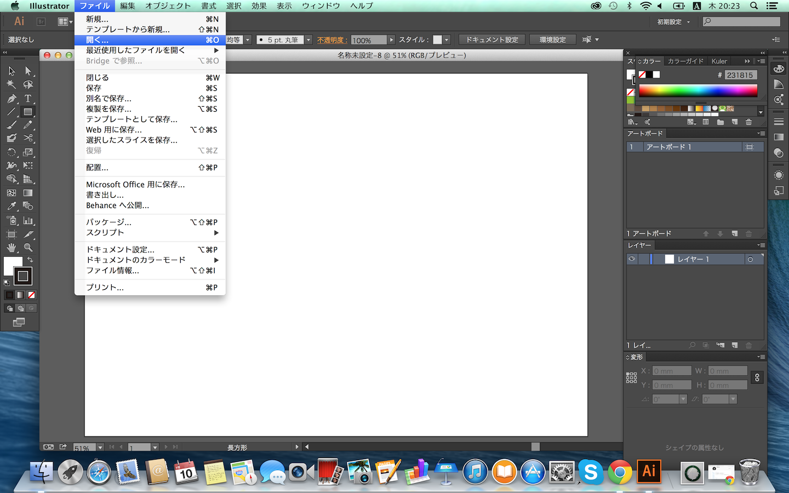
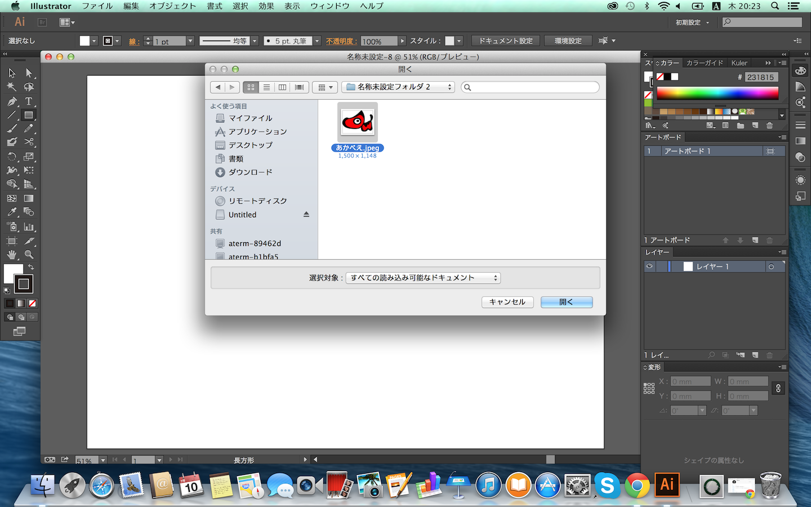
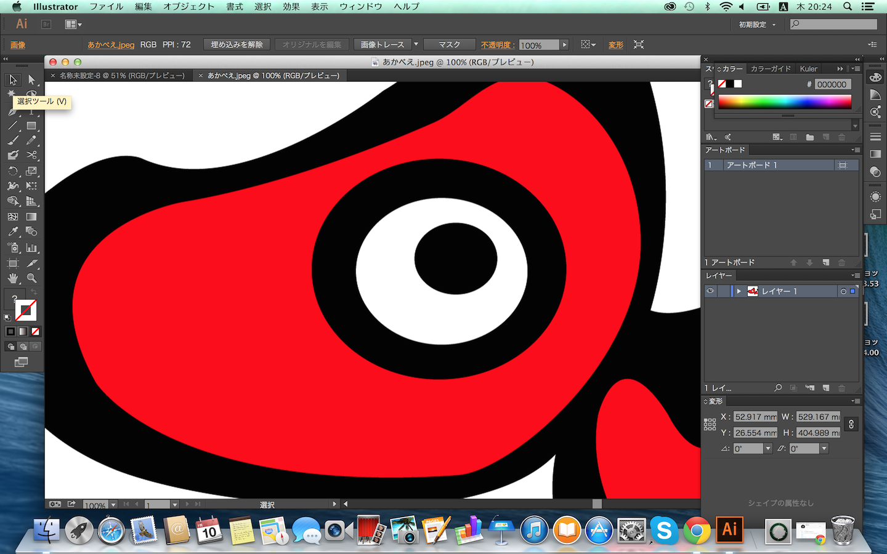
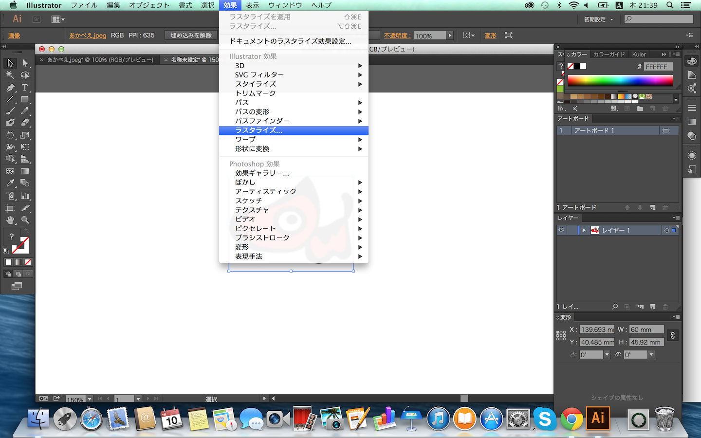
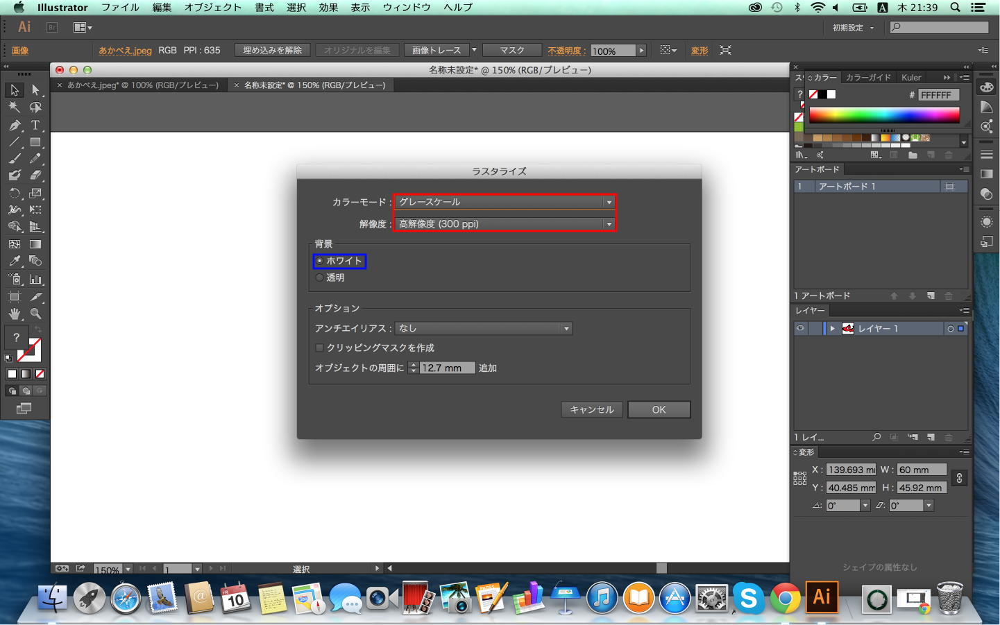
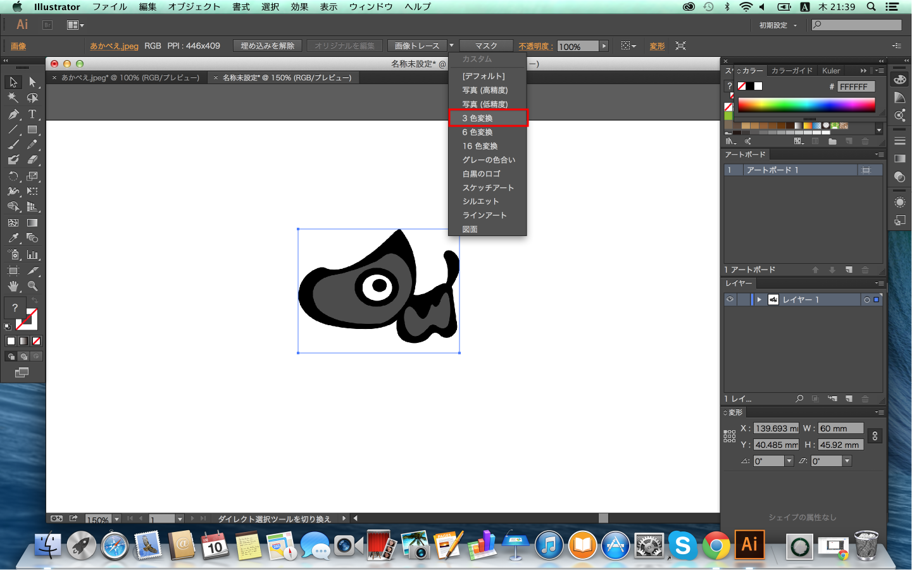
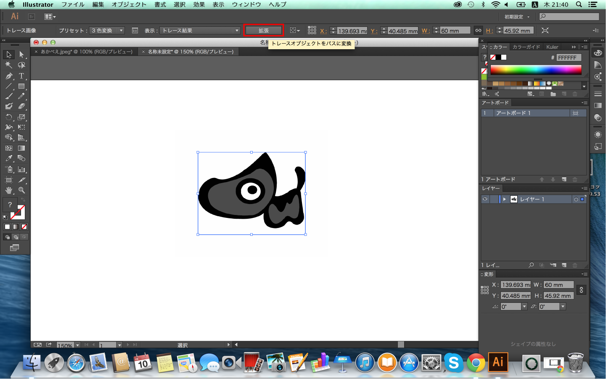
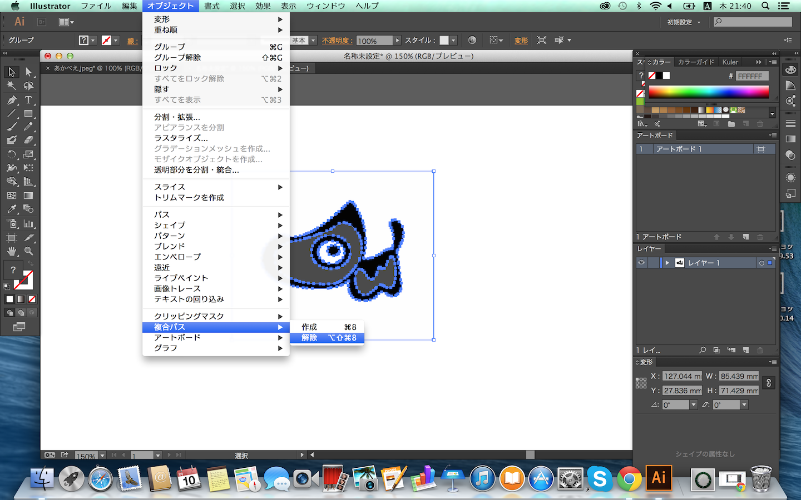
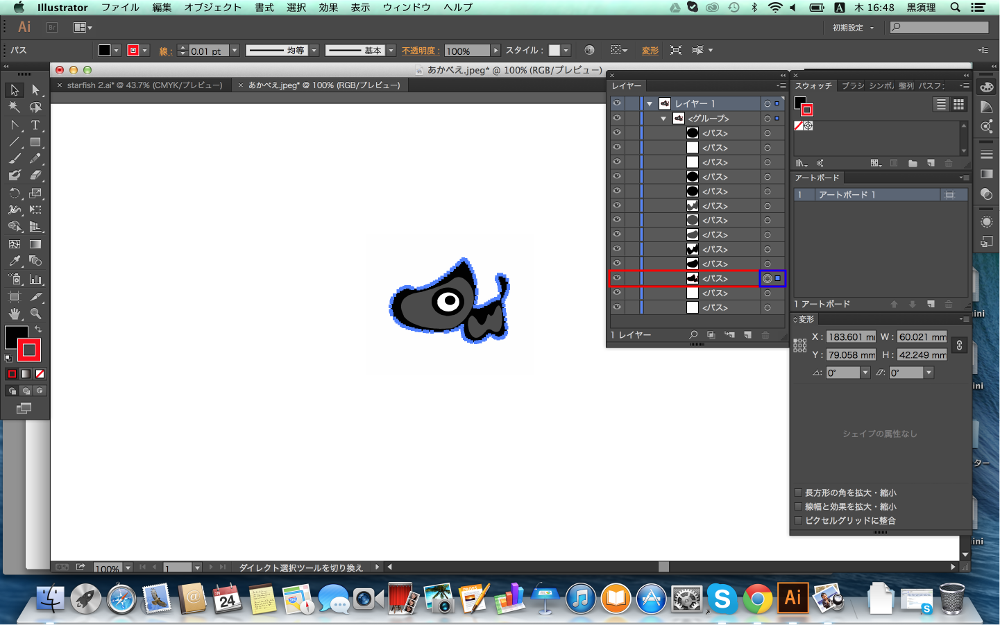

# 画像の形にくり抜きと彫刻する画像を用意しよう

Illustratorで会津のキャラクター「あかべぇ」の画像を取り込み、素材を画像の形に彫刻して切り出します。

画像は以下のファイルをダウンロードし(リンク先を別名で保存)、使用して下さい。
 

メニューの「ファイル」ー「開く」を選択します。
 

「あかべぇ」の画像ファイルを選び「開く」を選択します。
 

画像が大きすぎるため、「変形」を利用してサイズを調整します。
「変形」の「W」項目を60に設定しましょう。
 

彫刻するデータにする為に、画像のラスタライズを行います。
 

ラスタライズの設定は以下の通り
・カラーモード　グレースケール
・解像度　　　　高解像度(300ppi)

・背景　　　　　ホワイト**（重要）**
設定が出来たら「OK」を押します。

 

ラスタライズが完了したら画像がモノクロとなります。

次にくり抜きをする為に、「画像トレース」を行います。
「画像トレース」横にある三角のボタンを押して「3色変換」を選択します。
 

この時点では変換が完了していません、上部に出てくる「拡張」を押します。
 

画像トレースが完了したら
「オブジェクト」ー「複合パス」ー「解除」を選択していきます。

 

最後に一番外側のパスを選択します。

レイヤーウィンドウがない場合はメニューの「ウィンドウ」ー「レイヤー」を選択します。
レイヤーウィンドウから「レイヤー1」ー「＜グループ＞」と展開
下から３番目の＜パス＞の右にある「◯」をクリックして「◎」の状態にします。

 

スウォッチパネルと線幅の調整をします、左側のパネルは操作しないでください。

このときスウォッチパネルに色がないことがあります。

その時は青枠を選択してカラーピッカーを呼び出し
「R」を「255」と入力して「OK」を選択しましょう。

線幅を「0.01pt」と入力
ここまで出来たら完成になります。

次へ　STEP5. レーザーカッターで素材を切断してみよう