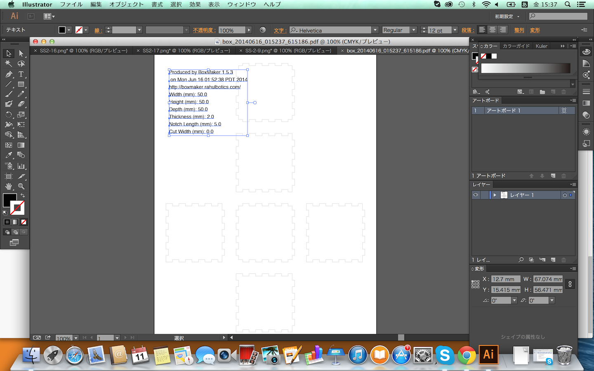

# 箱を作ってみよう

まず、箱を作るする為に下記のリンク先”Create a new box”の[BoxMaker]を利用して設計します。
http://boxmaker.rahulbotics.com/

まず[UNITS]を[millimeters]に切り替えてください。
 

下記の設定を行ってください。

<b>WIDTH　　　 50</b> 
<b>HEIGHT　　　50</b> 
<b>DEPTH　　　 50</b> 

MATERIAL THICKNESS　　　 2

設定が完了したら[Design it!]を選択してください。 
PDFファイルが作成されます。
 

出来上がったPDFファイルを開くと、この様な画像になります。
 

文字を選択して削除してください。
 

最後に六面に好きな絵や画像を書いて、レーザーカッターで切ってみましょう。
例：サイコロ
 

