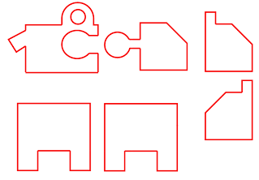
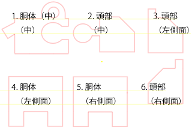
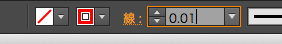
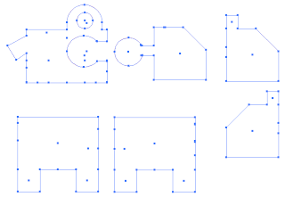

# 図面の作成

イラストレーターを使ってデータを作っていきます。 
ここでは赤べこの模様を作る行程を”彫刻”、 
形を切り抜く行程を”切断”、として説明します。 

レーザーカッター用の新規データ（白紙のキャンパス）を作ります。 
新規ドキュメントの作り方は　*コチラ*　を参考してください。 

まず赤べこの形を切り取る為のパーツ部分を描いていきます。 
色は赤に設定して、ペンツールで描きます。 
ペンツールでの描画方法は　*コチラ*　を参照してください。 

 

パーツの構成は以下の通りです。 
 

これらのデータは”切断”データとなるので、
レーザーカッターで切断データとして認識させる為に、
色を赤（このまま）、線の太さを　0.01pt　にします。
描いた線を、「選択ツール」で全部選択し、線の太さを変更します。
 

設定を確立させると、
 

こんな感じになります。
選択を解除して、赤い線が細くなっている事を確認してください。
切断データは完成しました。

今度は模様を描いていきます。
模様は彫刻データなので、黒で描いていきます。
今回は四角で描いていきます。

 

「2.頭部（中）」の丸い部分は、首のジョイント部分となる為、削らないと首振りがキツくなるので、模様と一緒に削ります。
レーザーカッター用のデータにする詳しい方法は　*コチラ*　を参照してください。

ai形式でファイルを保存します。
ファイル名は半角英数でお願いします。
（レーザーカッターが全角文字・特殊文字等、非対応の為、文字化けしますが、一応データとしては使えます。）

これでデータは完成です。

次へ＞レーザーカッターで切り抜き

上記のai形式のデータは下からダウンロード出来ます。
