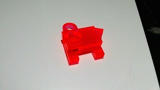

# 組み立て

ここからはアナログです！

まず頭部を作ります。
接着剤は慎重に。
#### 模様がある面が外側になるように気をつけましょう！

 

次に胴体。
まず側面パーツ1個と中パーツを固定します。
この段階で両側面を固定したらアウトです。アウトです！（二回言いました）
 

そして頭部のジョイント部分を接着剤無しで添えます。 
 接着剤がついてしまうと、首が動かなくなりますよ！
 

後は残りの側面パーツを固定して…
 

最後にお好みのキーチェーンを付けて完成です！
特別な技術は使っていないので、誰でも簡単に作れます！
 

赤べこは出荷よー(´・ω・`)