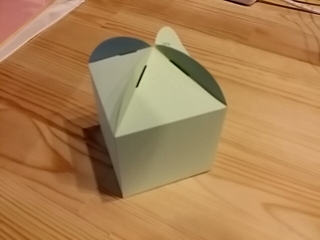

# 紙でギフトボックスを作る

 

アクリルや木（合板）ではなく、紙を使ってギフトボックスを作ってみましょう。

データの作り方は素材がアクリル等から紙に変わってもほぼ変わりません。
レーザーカッター側でレーザーの速度や出力を調整します。

このセッションでは、屋根開放型の箱を作っていきます。

紙は簡単に手に入れやすく扱い方法も楽なので、お手軽感があります。
お店で売っている既製品の箱とは違った雰囲気を出してみませんか？

準備するもの
* 紙
* のり
* レーザーカッター
* AI形式のデータ（箱の展開図）

次：展開図の準備