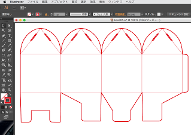

# 302.展開図の準備

このページの下部にある box2.zip をダウンロードします。 
ダウンロードしたら解凍します。 
そうすると２つのAIファイルが生成されます。 
box001.ai 
box002.ai 

今回使うファイルは box001.ai です。
 

※イラストレーターで開くとこんな感じで表示されます。 
　（この画像は線を見やすくする為にすこし太くしてあります）

太い線は切断、細い線は折りやすくするための彫刻です。

次：描画ソフトの準備

[box2.zip](https://github.com/FabKuraBase/Fab-Docs/blob/master/box2.zip)