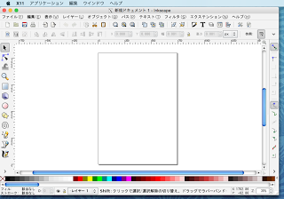
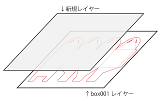
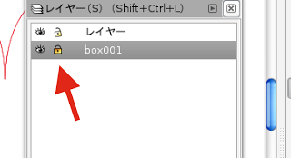

#レーザーカッター用のデータを描画する準備

先ほど解凍して生成された box001.ai を開きます。
ファイル　＞　開く　を選択し、box001.ai を開きます。
 

※開くと新しいウインドウでbox001.aiが開きます。（inkscapeの仕様）前にレーザーカッター用サイズに設定したデータは閉じても問題ありません。

次にレイヤーを追加します。
レイヤー　＞　レイヤー　を選択し、レイヤー設定ウインドウを開きます。
次に「　＋　」ボタンをクリックして、新規レイヤーを作ります。
※レイヤーの名前はなんでも良いです。

新規レイヤーを作ると、描画スペースは以下のようなイメージになります。
 

新規で作ったレイヤーに切断と彫刻を描画します。

box001レイヤーには描画しないようにロックをします。
レイヤー設定ウインドウにある鍵アイコンをクリックする度に、鍵アイコンの開閉状態を切り替えることができます。
閉まっている状態にして、box001レイヤーをロック状態にします。
ロック状態にする事で、box001のテンプレートを誤操作で変更するのを防ぎます。
 

新規で作ったレイヤーを選択します。
これで描画する準備は完了です。

次：切断用の線を描画する