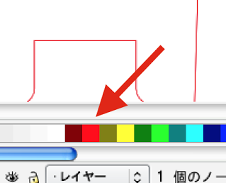
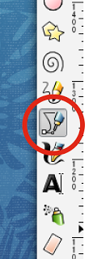
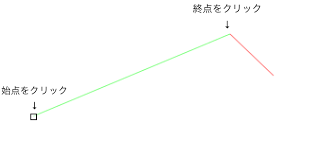
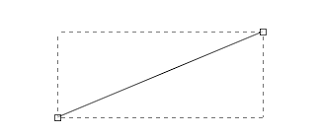
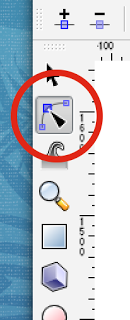
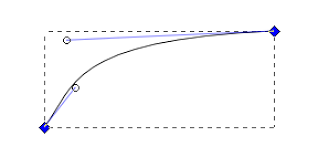
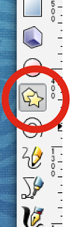

#切断用の線を描画する

レーザーカッターで切断する為の線を描きます。
紙を完全に切断します。

線の色を赤にします。 
基本的に赤で線を描きます。 
レーザーカッターが.切断を認識させるための設定です。 
カラーコードは #FF0000 です。 
線の太さは 0.01 pt にする必要があります。 
ですが、描画する時は見えやすい太さのままで構いません。 
あとでレーザーカッター用パソコンで変換します。 

 

パスツールを選択します。 
 

線を引きます。 
始点と終点を決めて描いていきます。 

 

水色の線が確定した線、赤色の線は未確定の線です。 
線が描き終わったら、キーボードのEnterキーを押します。 
すると、確定した線が描画されます。 
 

曲線を描く 
綺麗な曲線を描く場合は、ノードツールを使用します。 
上記の説明で描画したパスを選択したあとで、ノードツールを選択します。
 

曲げたい部分をドラッグします。 
 

始点終点にハンドルが現れます。 
これらをドラッグする事でも、曲線に変える事ができます。 
ハンドルが出ている状態で始点終点のどちらかをドラッグすると、線全体の位置が変更できます。 
ハンドルが出ていない状態で始点終点をドラッグすると、個々の位置が変更できます。 

固定の図形を切断する場合 
まる、四角、星型を描く場合は、星型ツールを選択します。

 

書きたいところでドラッグ操作をすると、下記のような図形ができます。 

レーザーカッターで切断するデータは線でなければいけません。 
このままだと彫刻と判断されてしまうので、塗りつぶしを解除します。 

図形が選択された状態で、ウインドウ左下（または右上）にあるフィルの色の部分をクリックするとフィル／ストローク設定ウインドウが開きます。 
フィルのスタイルを ”塗りなし”  にすると、線だけの図形になります。 

図形の形や角数を変える場合は、上部のメニューで変更します。 

＃＃＃　注意！　＃＃＃ 
凝った形を切断する場合は、残し部分を作らないと全部切断してしまいます。 
例えば下記のような図形だと、外側の５角形がぽっかり切断させ、星型は残りません！ 

次：彫刻用の画像を貼り付ける