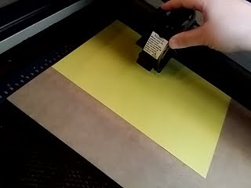

#レーザーカッターにデータを転送する

通常のプリンターと同じ感覚でデータを転送します。

レイヤー毎に加工していきます。
順番は、新規レイヤー　＞　彫刻レイヤー　＞　切断レイヤー　の順に行います。

新規レイヤーでは描画データの彫刻と切断を行います。
※はじめに切断レイヤーで切断してしまうと、冷却や集塵ブロワーの風で紙がズレてしまう為です。

次に彫刻レイヤーで折り目を作り、最後に切断レイヤーで完成となります。

レーザーカッター本体の準備
１、レーザーカッターの電源を入れる。
 

ヘッドとテーブルが原点復帰するので、ワークスペースには手を入れない事。（動作が止まるまで待機）
ヘッドが左上に移動したら原点復帰は完了です。

２、手順１の原点復帰が終わったら、紙をセットする。
※紙の下に約３mm程度の土台を敷く事。

３、ヘッドを紙の上に移動させ、オートフォーカスボタンを押す。
 

 

※レーザー照射の高さを自動で調整します。（動作が止まるまで待機）
パソコン側の準備
１、加工レイヤー以外のレイヤーを非表示にする。
　　目玉アイコンをクリックして閉じる。
２、メニューバーの　ファイル　＞　プリント　を選択。
３、用紙の方向、自動回転のチェックを外す。

※チェックを外した直後はプレビューは変化しない。

４、左下にあるプリンターをクリックする。

５、詳細設定をクリックする。

６、上部の”Pen"タブをクリックする。

該当レイヤー加工時のPowerとSpeedを設定する。

彫刻する為のデータのPowerとSpeedの目安は、
Power : 30
Speed : 90
早く、弱く。
ヘッド（レーザー照射）が細かく往復します。

折りやすくする為のデータのPowerとSpeedの目安は、
Power : 40 
Speed : 80
早く、弱く。
折りやすくする為の彫刻は、彫刻データにすると時間がかかる上に往復でレーザー照射する為、紙が切れてしまう可能性を考慮して、切断データ（赤線）でPowerを弱くして１回だけレーザー照射にしています。

切断する為のデータのPowerとSpeedの目安は、
Power : 80
Speed : 20
強く、遅く。

※ 数値は　”独自調べ”　です。