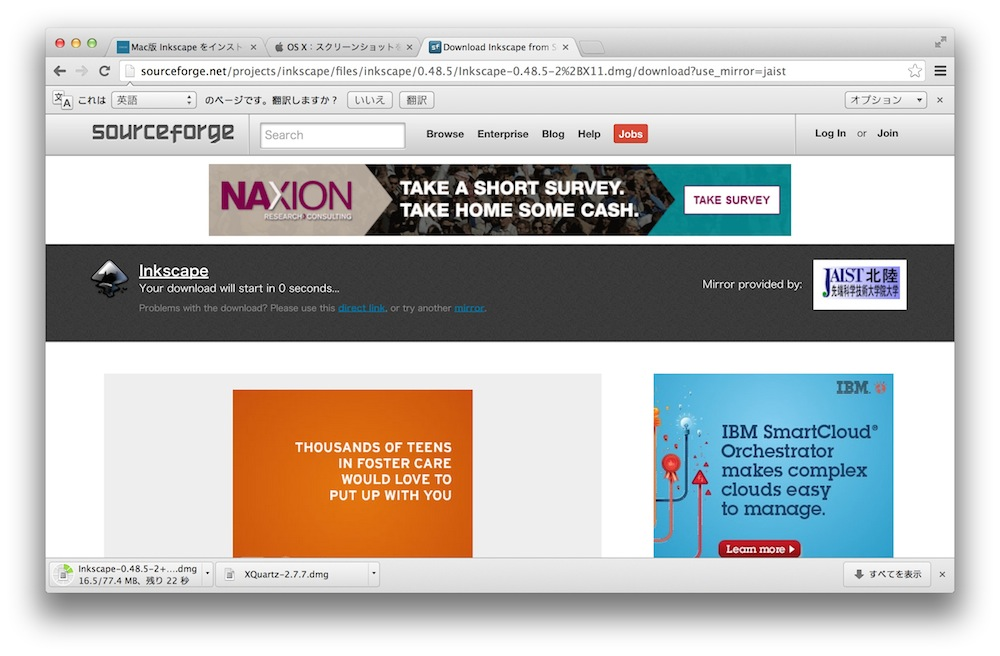

# 環境設定

## Inkscapeのインストール

まずはInkscapeの公式サイトにアクセスします。
 
http://www.inkscape.org/en/

次に上部のバーにあるダウンロードにマウスオーバーしてOSを指定します。
 

 

### Mac OS の場合

#### XQuartzのダウンロード

MACの場合、Inkscapeを使用するにはXQuartzが必要となりますので、まずXQuartzをダウンロードします。
 
赤い矢印のところをクリックすると自動的にダウンロードが始まります。

ダウンロードが完了するとXQuartz-X.X.X.dmgがアイコンとして出てくるのでダブルクリックします。
 

中にある「XQuartz.pkg」をダブルクリックします。
 

インストールが開始します。
すべて「続ける」をクリックします。
 

 

 

「同意する」をクリック
 

「インストール」をクリック
 

OSXのログインパスワードを入力します。
 

インストールが開始します。
 
10分程度の時間がかかります。
 

これでXQuartxのインストールが完了です。
 

 

#### Inkscapeのダウンロード(MAC)

次にInkscapeをダウンロードします。
 
まずこのアイコンをクリックします。
 

この画面５秒ほど待ちますと自動的にダウンロードが開始します。
 

ダウンロードが完了したらInkscape-0.48.5-2+X11.dmgをダブルクリックし、ファイルを展開します。
 
展開すると下の様なウィンドウが出てくるのでInkscapeのアイコンをApplicationにドラッグ&ドロップします。
 

インストールはこれで完了です。

 

#### Inkscapeの起動(MAC)

次にLaunchPadからInkscapeを起動します。
 
このような画面が出てくる場合、「システム環境設定」から「セキュリティとプライバシー」を選択します。
 
一番下にある「このまま開く」を選択します。
 

このウィンドウが現れるので画面右下の「Browse...」を選択します。 

「アプリケーション」→「ユーティリティ」に XQuartz があります。
 
XQuartz を指定して「Choose」をクリック。
 

このまま起動しないので一旦システムを再起動します。
 
再起動後、もう一度Inkscapeを起動してください。
 
OKをクリックします。
 

Inkscapeが起動します。
 

## Windowsの場合

好みの形式を指定してダウンロードサイトにアクセスします。
 

矢印の部分をクリックしてダウンロードを開始します。
 

#### インストール方法

特に指定がない場合は「次へ」を押してインストールします。

## Inkscapeを日本語化する方法

「File」から「Inkscape Preferences」を開きます。([shift] + [control] + [P])
 

Interfaceを選択してください。
 
LanguageでJapanese (ja) を選択します。
 

Inkscapeを再起動すると日本語化完了です。
 

※日本語化した後に起動するとエラーとなり起動できない場合があります。
 
その場合は下記の場所にあるファイルをテキストエディタで開き、編集して下さい。

[場所]
　inkscapeのアプリケーションファイルを右クリックし「パッケージ内の内容を表示」>「Contents」>「Resources」>「bin」>「inkscape」

[変更内容]
 
 153行目に1行追加し、内容を「export LANG=ja_JP.UTF-8」 として保存。
 

変更して保存後、Inkscapeは問題なく起動することができます。