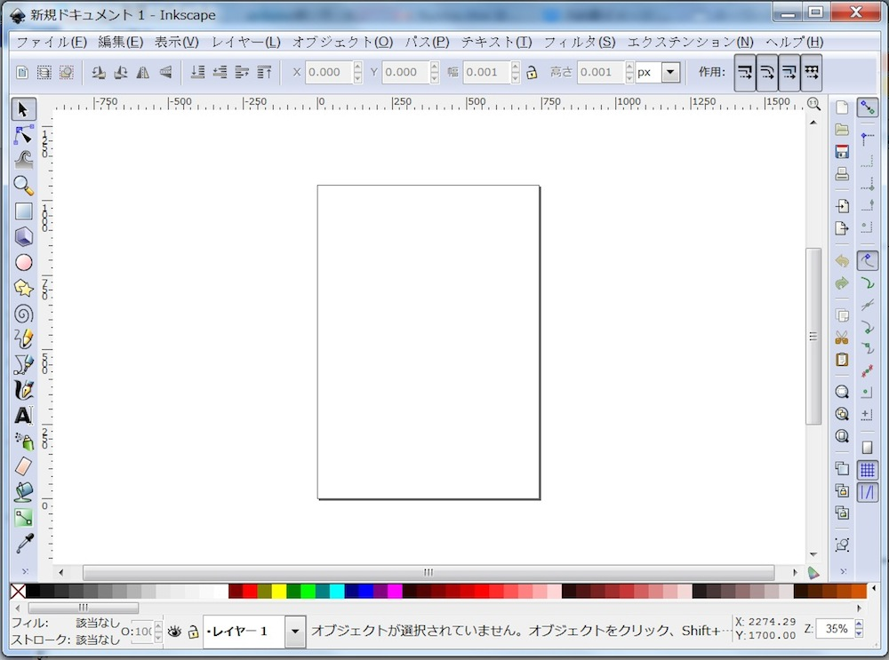
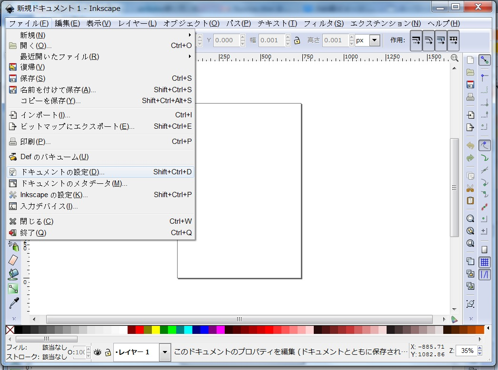
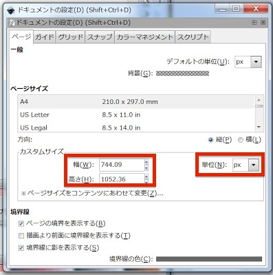
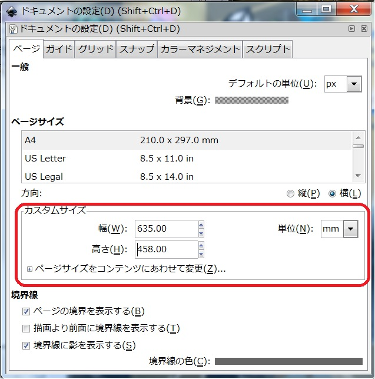

# ドキュメント作成

レーザーカッターを使う場合、まずファイルのサイズを設定する必要があります。

Inkscapeを開くとこのような画面がでます。
 

「ファイル」→「ドキュメントの設定」を押します。
 

このような画面が出ます。
この画面でレーザーカッター用にサイズを指定します。
 

まずは単位を「mm」に変更しサイズを指定します。
 
次に幅を635、高さを458に変更します。
 

