# 各ツールの機能

Inkscapeの左にあるツールバーの内容について簡単に説明します。

 
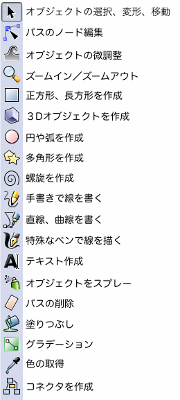

 

 
オブジェクト上で左クリックすると選択できます。
 
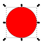

この状態で矢印をドラッグするとその方向に向かって拡大、縮小します。
Ctrlキーを押しながらドラッグすると全方向に等倍できます。

この状態でもう一度クリックすると回転ができます。
 
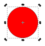

Ctrlキーを押しながらドラッグすると15度間隔で回転できます。

選択した状態でドラッグすると移動ができます。

 

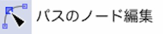

選択したオブジェクトのパスを編集できます

（例）

 

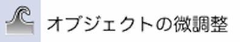

 

左クリックでズームイン
Shift+左クリックでズームアウトできます。
 
パスが細かくて編集しづらいときなどに使用します。

ほかのツールを使用してる場合でもセンターホイールをクリックすると拡大できます。
 
また、Shiftをおしながらセンターホイールをクリックすると縮小できます。
 
ショートカットを覚えると効率がよくなるので是非覚えましょう。

 

ドラッグすることにより矩形（長方形）を作成できます。

右上の丸い部分をドラッグして移動することで角を丸めることができます。

 

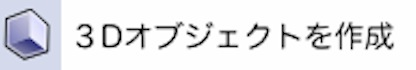

 

ドラッグすることにより円を作成できます。
右の丸い部分をドラッグして移動することで円弧にすることができます。

 

長方形や円の作成ツールと同様にポリゴンや星型を作成します。

上部のバーで角数(頂点数)を指定したり、スポーク比（「頂点半径（外側）」と「基準半径（内側）」の比率）を変更できたりします。
 
標準の星はスポーク比0.500です。

 

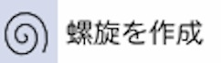

螺旋を作成
　渦巻きを作成することができます。終端の丸をドラッグすることで長さを変えられます。

 

 

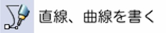

 

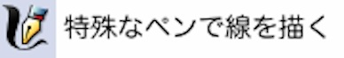

 

 

 

 

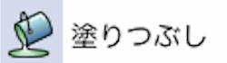

 

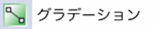

 

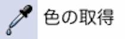

 

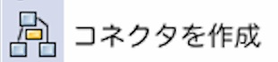
