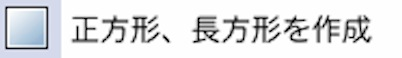
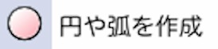
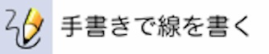

# 各ツールの機能

Inkscapeの左にあるツールバーの内容について簡単に説明します。

 

 

 
オブジェクト上で左クリックすると選択できます。
 

この状態で矢印をドラッグするとその方向に向かって拡大、縮小します。
Ctrlキーを押しながらドラッグすると全方向に等倍できます。

この状態でもう一度クリックすると回転ができます。
 

Ctrlキーを押しながらドラッグすると15度間隔で回転できます。

選択した状態でドラッグすると移動ができます。

 

選択したオブジェクトのパスを編集できます

 

 
オブジェクトの場所の微調整を行います。

 

左クリックでズームイン
Shift+左クリックでズームアウトできます。
 
パスが細かくて編集しづらいときなどに使用します。

ほかのツールを使用してる場合でもセンターホイールをクリックすると拡大できます。
 
また、Shiftをおしながらセンターホイールをクリックすると縮小できます。
 
ショートカットを覚えると効率がよくなるので是非覚えましょう。

 

ドラッグすることにより矩形（長方形）を作成できます。

右上の丸い部分をドラッグして移動することで角を丸めることができます。

 

 
3D風のオブジェクトを作成します。

 

ドラッグすることにより円を作成できます。
右の丸い部分をドラッグして移動することで円弧にすることができます。

 

長方形や円の作成ツールと同様にポリゴンや星型を作成します。

上部のバーで角数(頂点数)を指定したり、スポーク比（「頂点半径（外側）」と「基準半径（内側）」の比率）を変更できたりします。
 
標準の星はスポーク比0.500です。

 

渦巻きを作成することができます。
 
終端の丸をドラッグすることで長さを変えられます。

 

 
フリーハンドで線を書くことが出来ます。

 

 
直線で図形を作成後、パスのノード編集ツールにて曲線にすることができます。

 

 
特殊なペンで線を書くことができます。
 
このペンを使用すると布や紙のような形状になります。

 

 
テキストを作成することができます。
 
Macでは日本語を入力することができませんが、他のテキストエディタ等から日本語をコピーすることで設定することは可能です。

 

 
選択したオブジェクトをスプレーで噴射するように複数出力します。

 

 
パスを削除することができます。

 

 
選択した箇所を選択している色で塗りつぶします。

 

 
対象のオブジェクトの色をグラデーションにします。

 

 
選択箇所の色を取得し、使用する色に設定します。

 

 
オブジェクトを線で繋ぎます。
