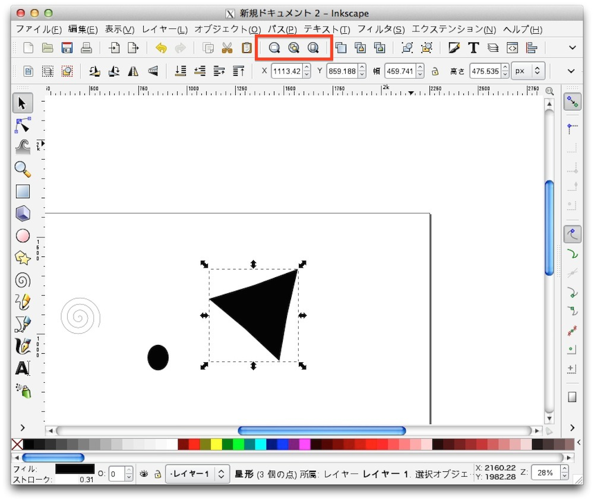
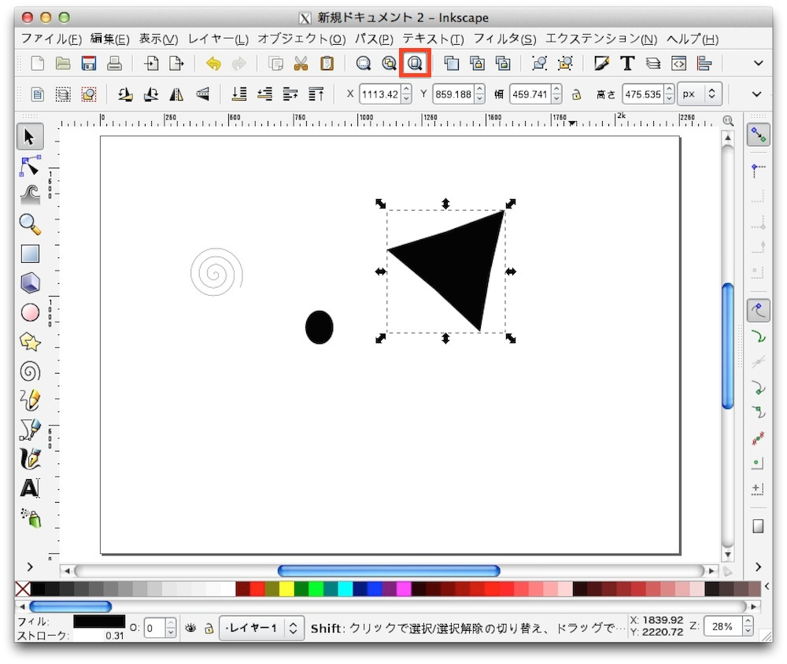
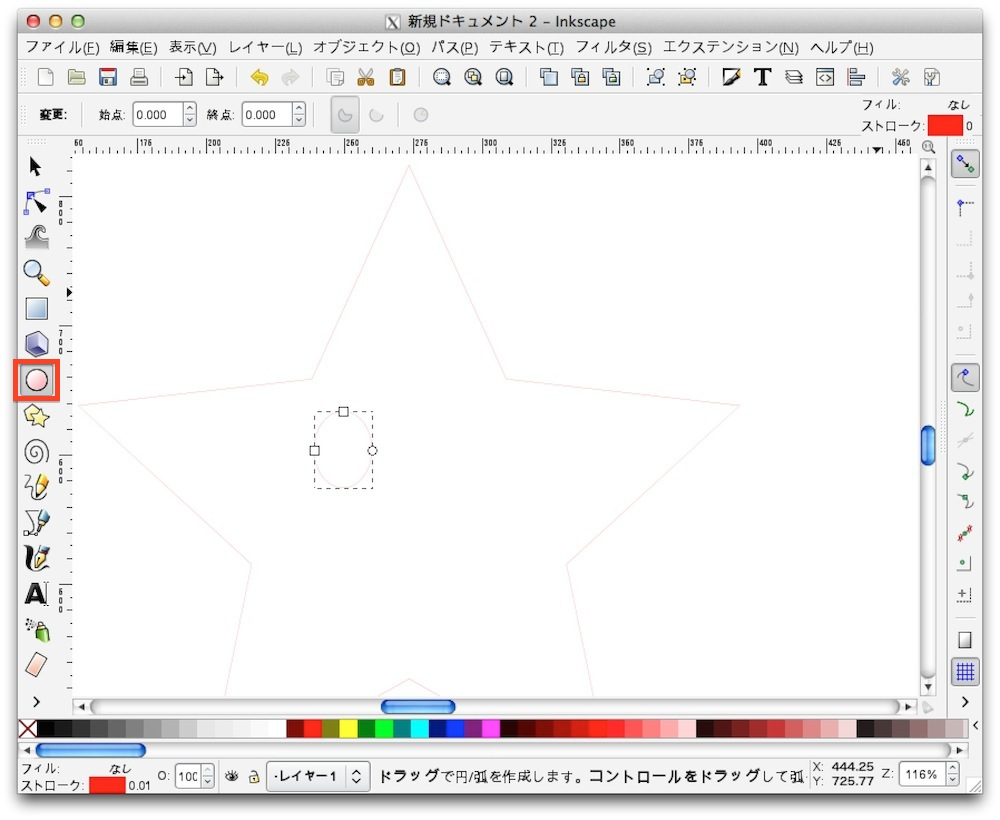

# 切断データの作成

## ズーム機能について

作成する前にズーム機能についていくつか紹介します。

画面上の中央にある３つを使用します。
 

 

まずは一番右にあるアイコンです。
 
これはドキュメント全体を表示する機能です。
 

 
次に真ん中のアイコンです。
 
これはオブジェクト全体を表示する機能です。

 

最後は左のアイコンです。
 
これは選択したオブジェクトを表示する機能です。

 

## 切断データの作成

切断データの作成をしていきます。
 
ここでは星のキャラクターを作成したいと思います。

まずツールバーより多角形ツールを選択し、星を作成します。
 
上のメニューにある星マークを選択し、「角」の項目を５に設定する事で星形にすることができます。
 

 
レーザーカッターでは、色の塗りつぶしは彫刻として扱われるため、この塗りつぶしを解除します。

画面左下にフィル、ストロークという項目があり、その隣に色が設定されています。
 
その場所をダブルクリックし、設定画面を表示させます。
 

 

 
表示された画面の「フィル」というタブを選択し、塗りのパターン設定の一番左にある「×」を選択します。
 
すると星の塗りつぶしが消えた状態となり、何も見えなくなります。

 

次にカットする線を設定します。

先ほどの設定画面より「ストロークの塗り」を選択します。
 
線のパターン設定で「×」の１つ右にある塗りつぶしを選択します。
 
カットする箇所の色は赤(R255,G0,B0)で設定する必要があるので、下記の用に色を変更します。

|色|設定値|
|--|--|
|R|255|
|G|0|
|B|0|
|A|255|
 

 

次に線の太さを設定します。
 
レーザーカッター側では、線の太さが「0.01px」で設定されている箇所をカットするという設定になっています。
 
そのため、この線の太さについても幅を「0.01」に設定する必要があります。

「ストロークのスタイル」タブを選択し、「幅」の項目を「0.010」に変更します。
 

 

環境によりますが、線の太さを変更すると画面上では見えなくなってしまいます。
 
その場合はツールバーより虫眼鏡のツールを選択し、表示箇所を拡大して下さい。
 
するとこのように見えるようになります。
 

 
線の太さ変更するとわかりにくい場合、編集時は太めの線で作成し、保存する際に太さを変更するというやり方で問題ありません。

 

次にキャラクターの目を作成します。
 
円弧ツールで丸い図形を２つ作成します。
 

 

目の次は口を作成します。
 
まずは大きめの円を目と同じように作成します。
 

 

欠けた円の図形の内、左側の扇形の図形を選択します。
 
その状態で始点に「0」、終点に「180」を設定します。
 
すると口のような図形が作成されます。
 

 
図形の編集を行います。
 
星形の角が尖っている状態では出力した後に怪我をする可能性があるため、角を少し丸めます。
 
画面上の「丸め」という項目に「0.1」を設定します。
 
これで角が丸くなりました。
 

 
選択ツールで位置や大きさの調整をして完成です。
 

 

## 作成データの保存

作成したデータを保存します。
 
メニューのファイルより、「名前をつけて保存」を選択します。
 

 

