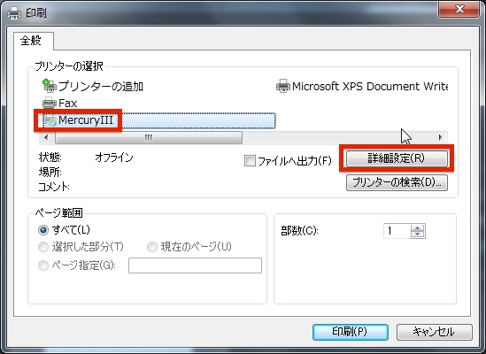
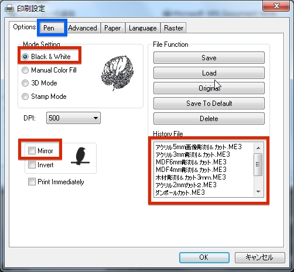

# レーザーカッターの使い方

レーザーカッターを使用する際は、Illustratorというソフトを使用します。

Illustratorを起動し、メニューより「ファイル」 > 「開く」を選択します。
 

 

作成したファイルを選択し、「開く」を押します。

 

画像を開きましたら調整を行います。
 
変形という箇所で画像のサイズや位置を変更することができます。
 
変形が表示されない場合、メニューより「ウィンドウ」> 「変形」と選択することで表示させることができます。
 

 
今回の場合は下の設定で出力します。
 

 

 

 

 

 

 

 

