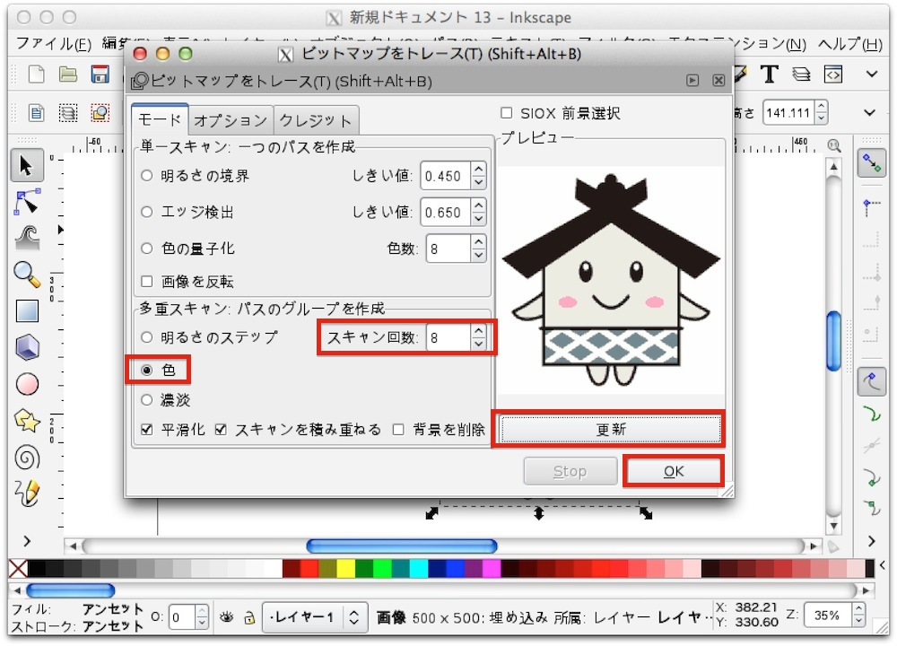

# 彫刻データの作成

ここでは画像を取り込み、キャラクターの形で切り抜くということをやってみます。

まず、この画像を保存して下さい。
 

新しくドキュメントを作成し、サイズを変更後(単位「mm」 横「635」、縦「458」）、メニューより「ファイル」> 「インポート」を選択します。
 

先ほど保存した画像を選択し、「Open」を押します。
 

画像取り込みの設定がでてきますので、「埋め込み」を選択した状態で「OK」を押します。
 

画像が表示されました。
 

画像を選択した状態で、メニューより「パス」>「ビットマップをトレース」を選択します。
 

トレースの設定が出てきますので、多重スキャンのスキャン回数に「8」を設定、色にチェックをつけた状態で「更新」を押し、画像が表示されたところで「OK」を押します。
 

