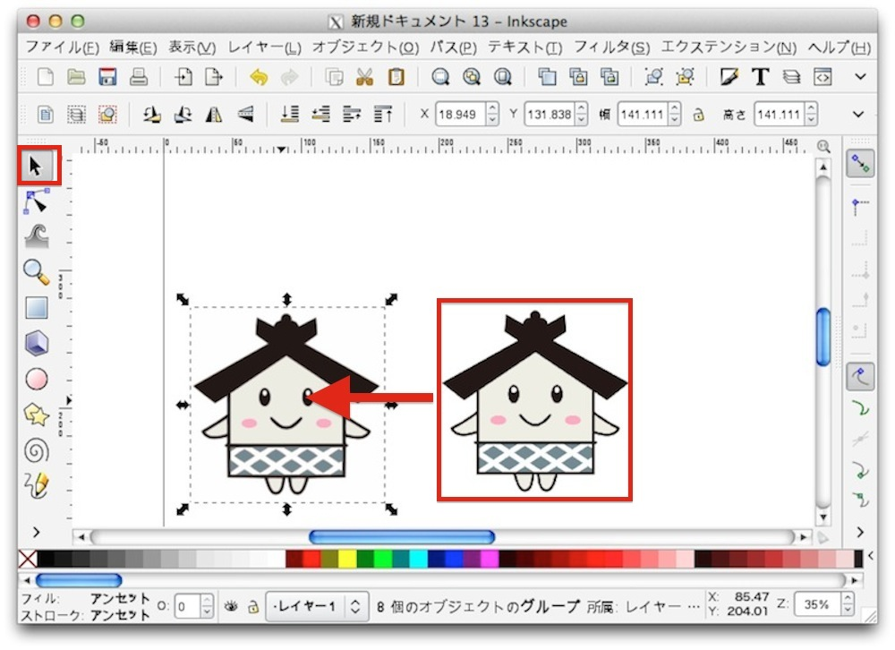
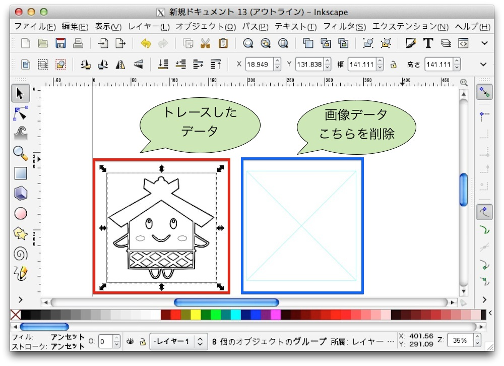
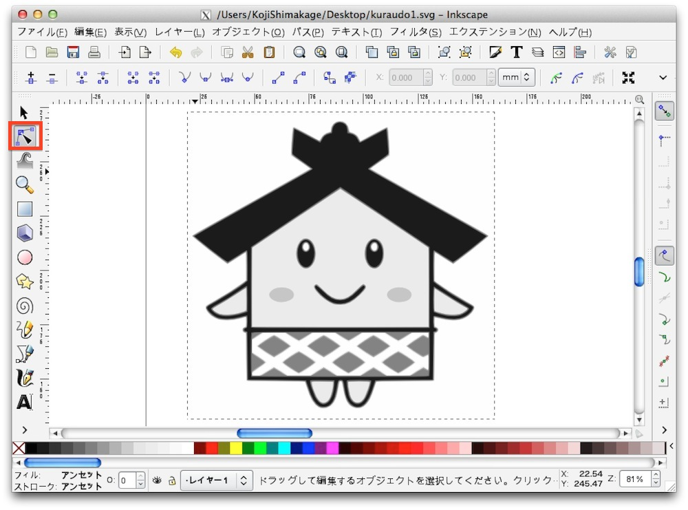
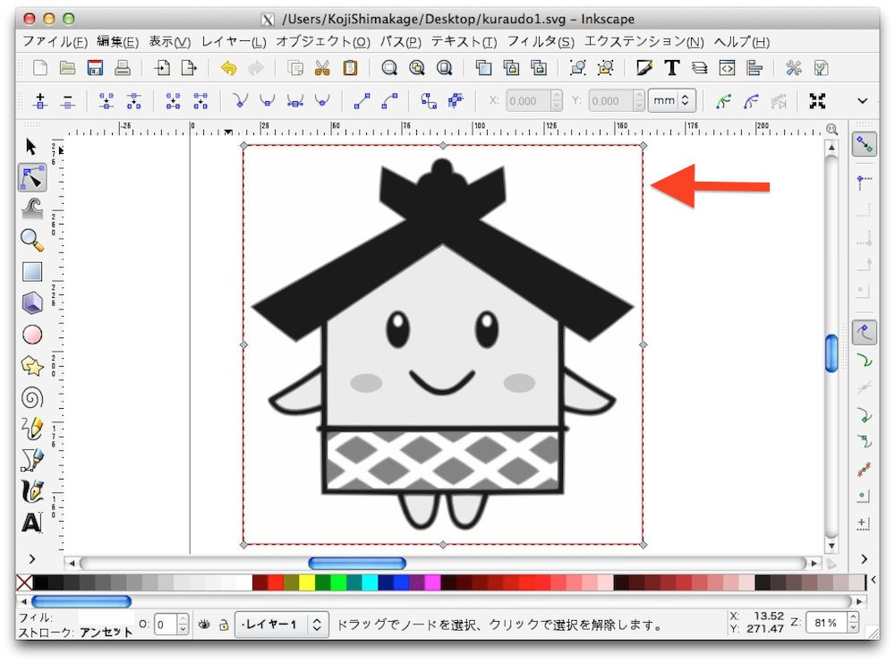
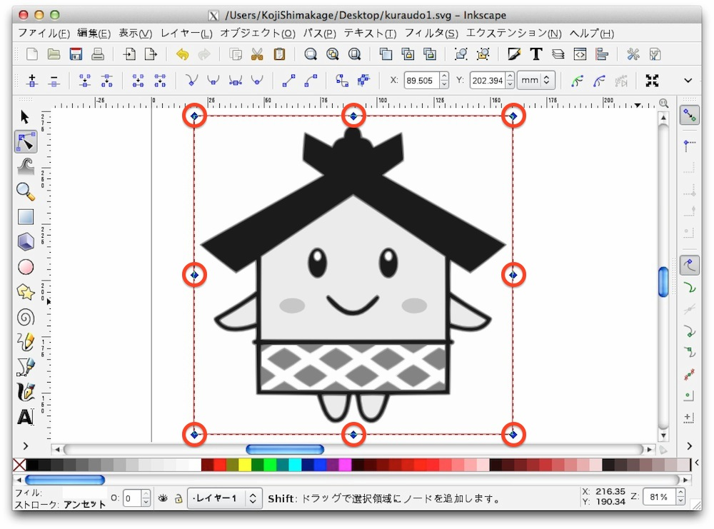
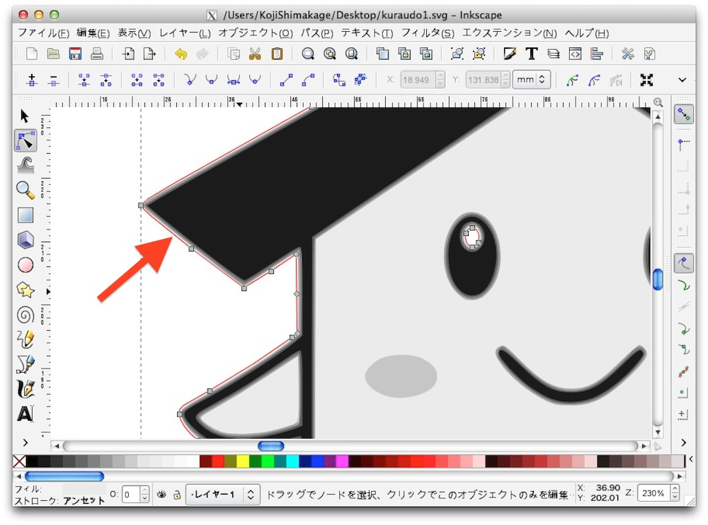
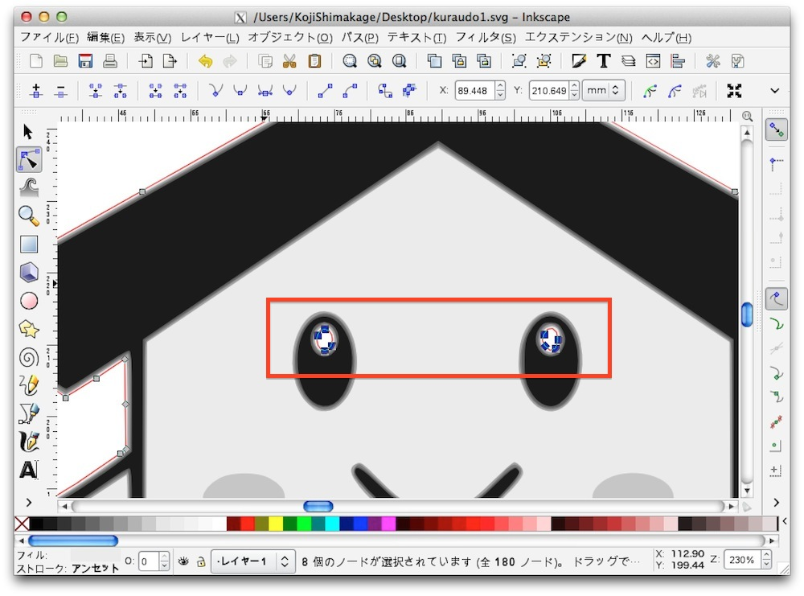
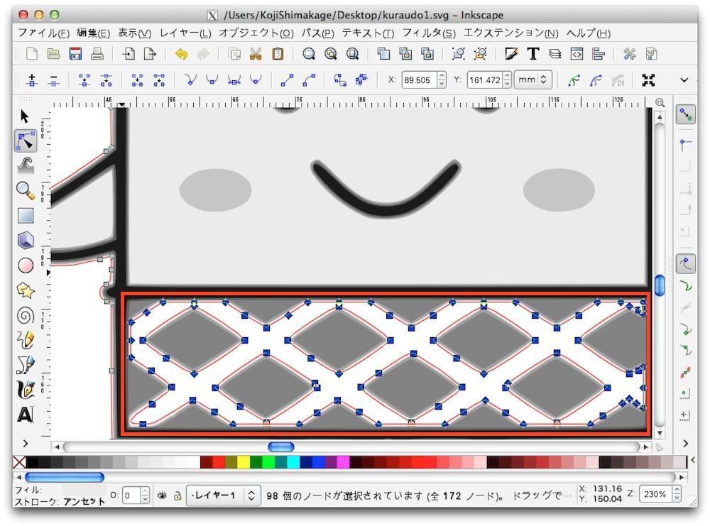

# 彫刻データの作成

ここでは画像を取り込み、キャラクターの形で切り抜くということをやってみます。

まず、この画像を保存して下さい。
 

新しくドキュメントを作成し、サイズを変更後(単位「mm」 横「635」、縦「458」）、メニューより「ファイル」> 「インポート」を選択します。
 

先ほど保存した画像を選択し、「Open」を押します。
 

画像取り込みの設定がでてきますので、「埋め込み」を選択した状態で「OK」を押します。
 

画像が表示されました。
 

画像を選択した状態で、メニューより「パス」>「ビットマップをトレース」を選択します。
 

トレースの設定が出てきますので、多重スキャンのスキャン回数に「8」を設定、色にチェックをつけた状態で「更新」を押し、画像が表示されたところで「OK」を押します。
その後、「ビットマップをトレースのウィンドウ」を閉じます。
 

この状態では何も変わっていない様に見えますが、トレースされたデータが元画像の上に配置されています。 
選択ツールを選択し、画像をドラック&ドロップで左に移動しましょう。 

ここで元の画像データを削除するのですが、どちらが元画像データがわからなくなってしまった場合、メニューより「表示モード」>「アウトライン」を選択します。
 

モードを変える事によりトレースしたデータと元画像データがわかりやすくなります。
 
ここで画像データを削除します。
 

表示モードを標準に戻し、選択ツールで画像を選択します。
 

メニューより、「エクステンション」>「色」>「グレースケール」を選択します。
 

グレースケールが終わると画像が白黒になります。
 

ツールバーよりパスノード編集ツールを選択します。
 

キャラクターの回りにある四角を選択します。
 

「shift」キーを押しながら8個の点を選択します。
 

「delete」キーを押し、選択したパスを削除します。
 

キャラクターの一番外側のパスを選択します。
 
そのためにまずツールにより拡大します。
 

外側を選択する下のような表示になります。
 
この画像の場合、目の白い部分も選択されます。
 

一番外側のパスを選択しましたら、不要なパスを削除します。
 
「shift」キーを押しながら下の赤枠の範囲を選択し、目の白い部分のパスを選択します。
 

選択後、「delete」キーによりパスを削除します。
 

次に腰巻き部分のパスを削除します。
 
先ほどと同じ様に下の画像の赤枠の部分を範囲選択し、削除します。
 

削除が終わりますと外枠だけが選択された状態になります。
 

次に外枠の線の設定を行います。
 
ストロークの塗りを(R「255」、G「0」B「0」 、A「255」に設定し、ストロークのスタイルの線幅に「0.010」を設定します。
 

これで完了です。
 
保存後、Illustratorにてファイルを読み込み、画像サイズを調整して出力を行って下さい。
 

