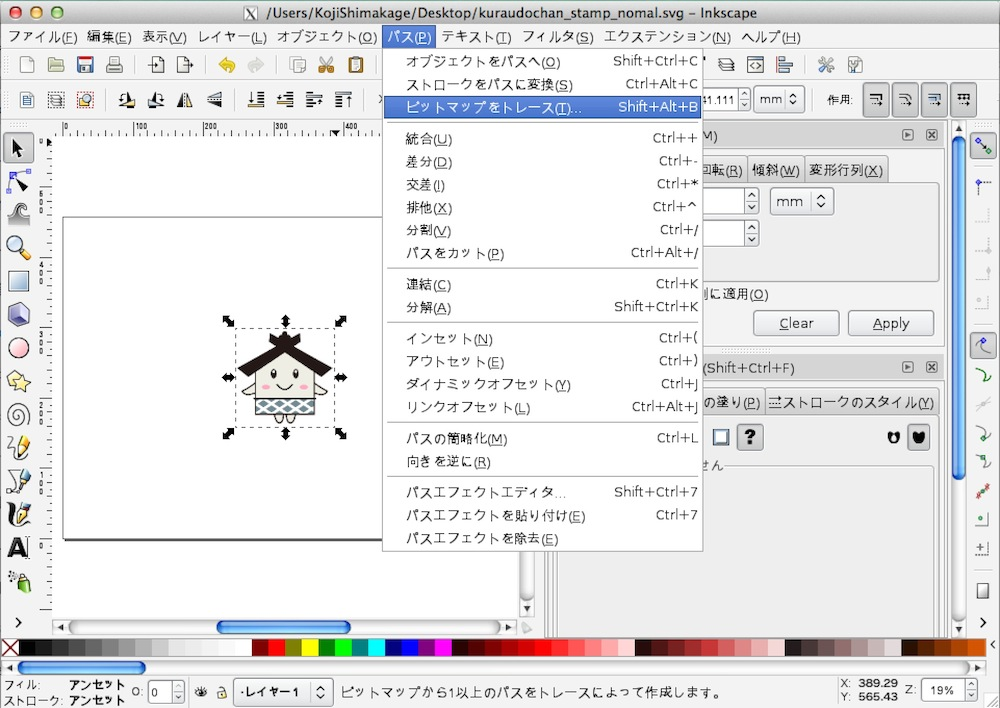
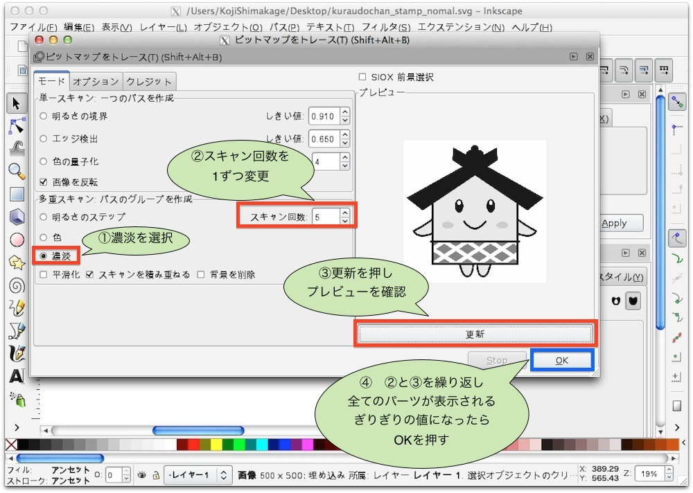
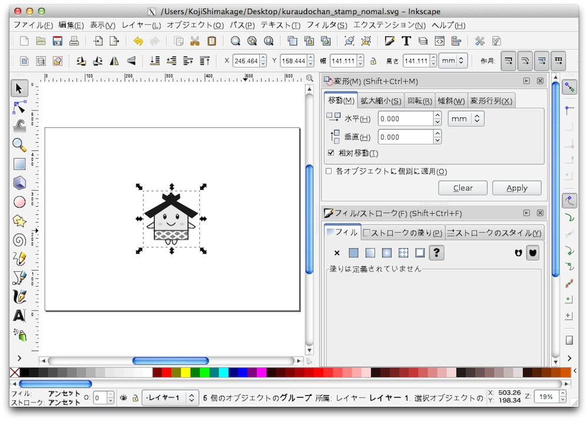
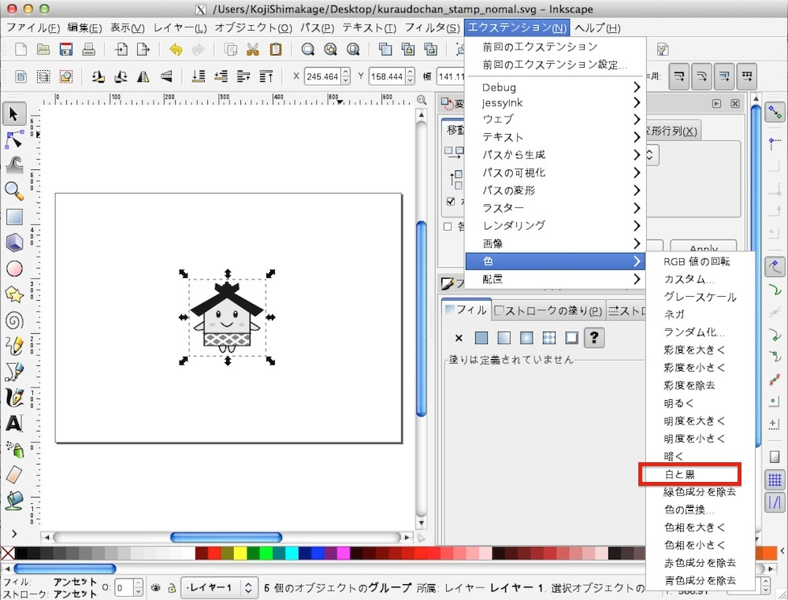
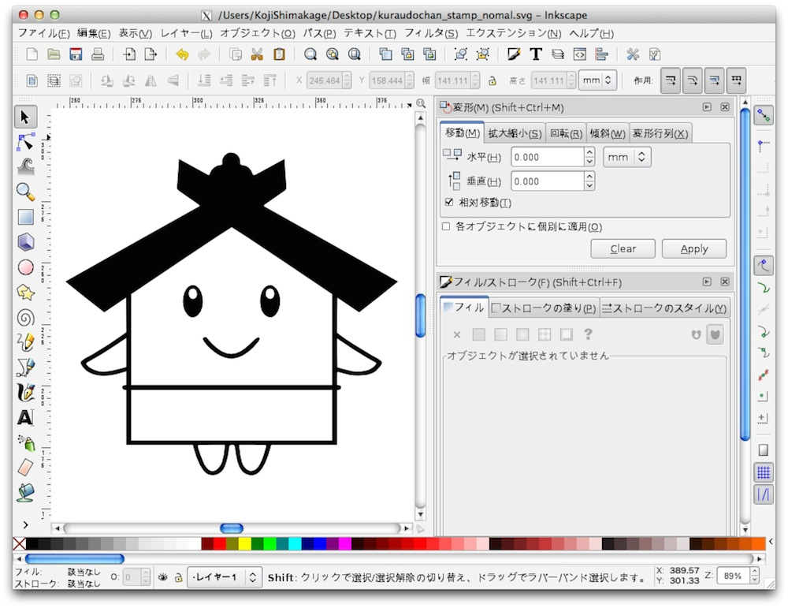
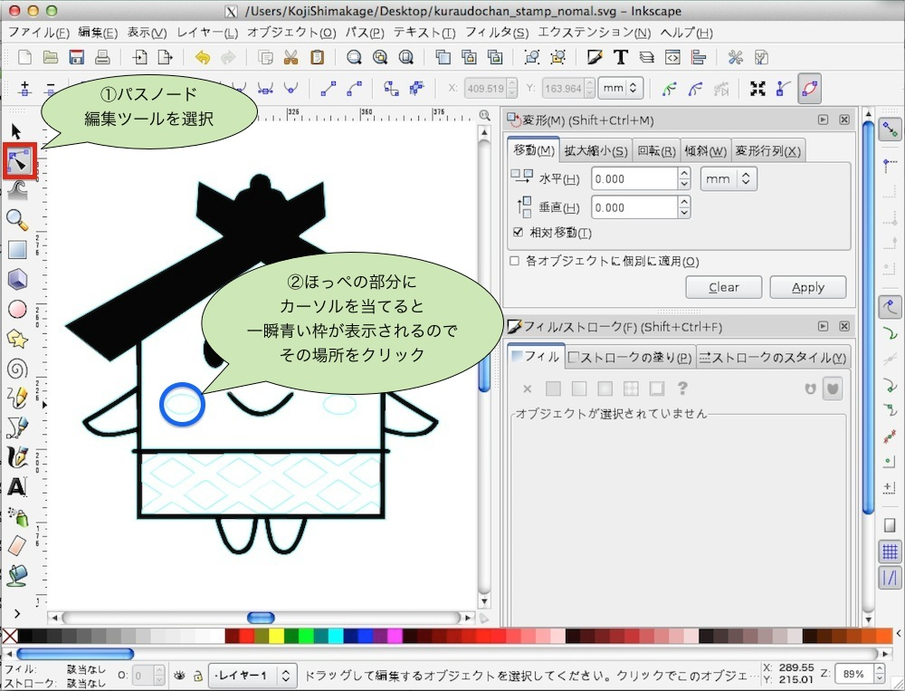
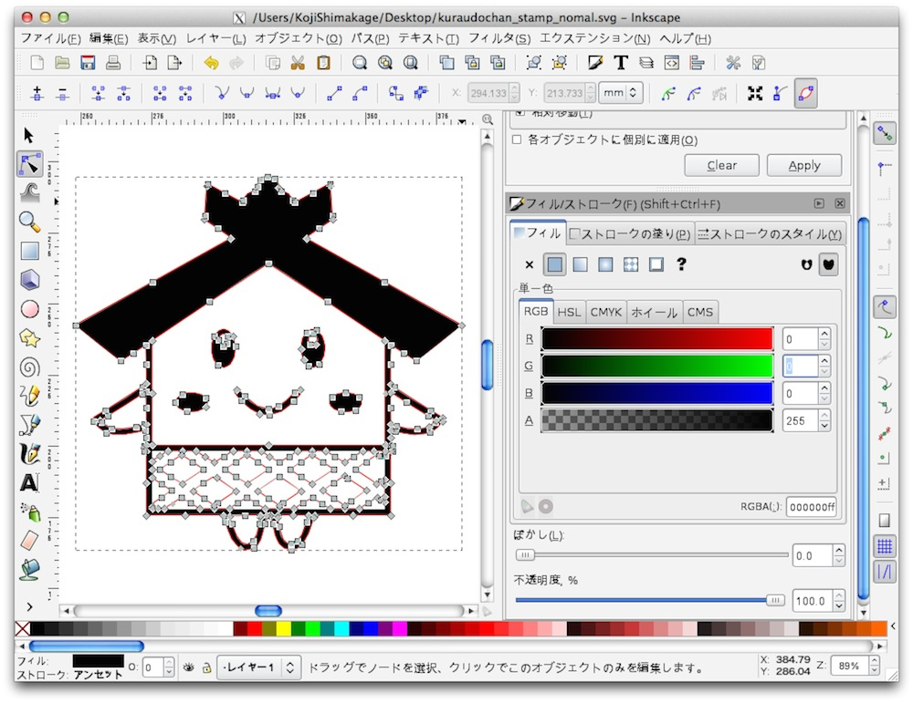
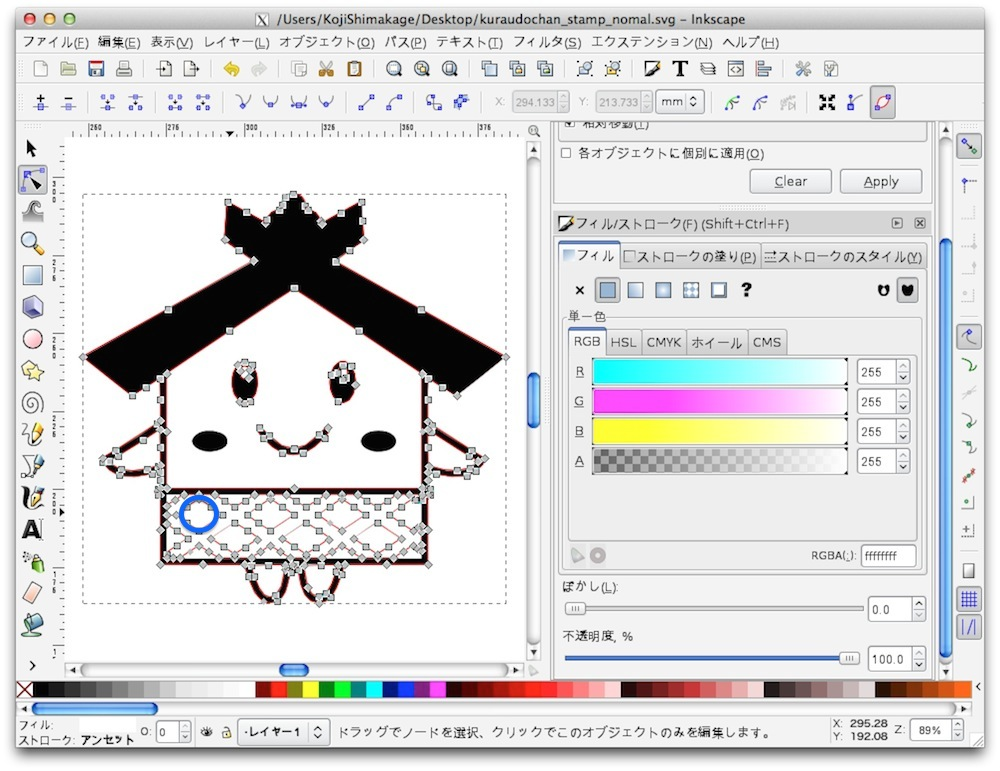
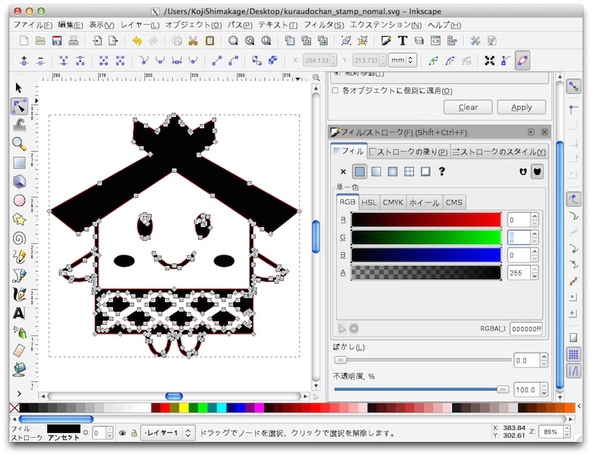
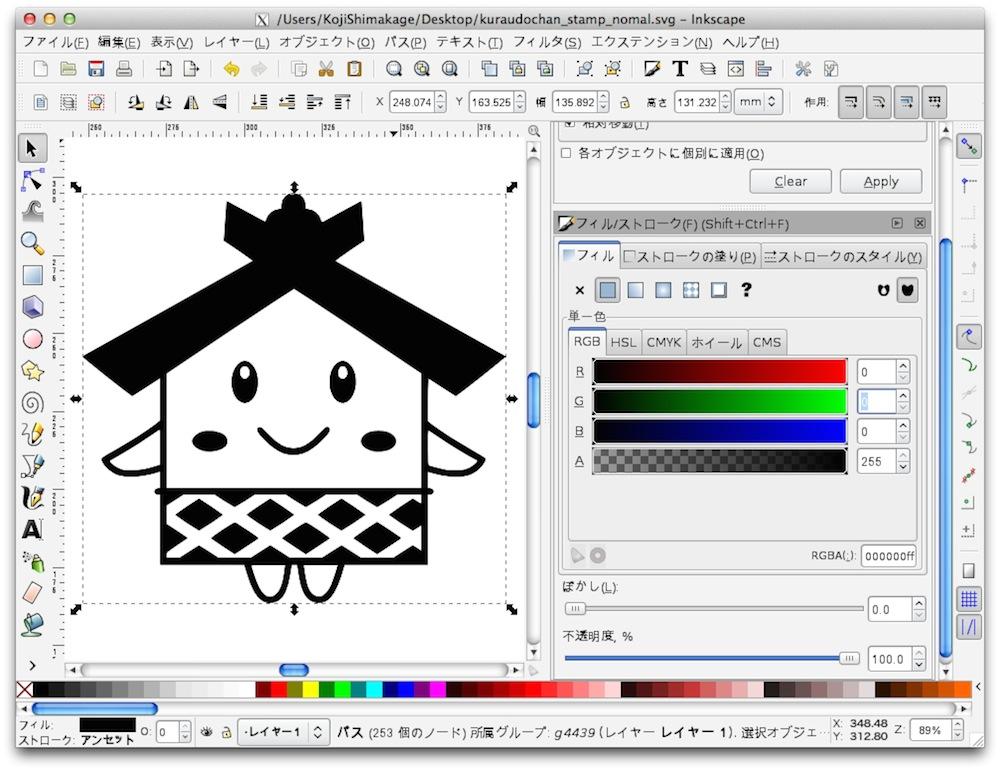

# スタンプの作成

ここからは自由にスタンプを作成して頂きたいと思います。
 
サイズは25mm×25mmの正方形です。

作成例を記載しますので、この例を参考に作成してみて下さい。
 

※Inkscapeにて文字編集を行った場合、Illustratorにデータを移動した際にエラーが発生することがあります。
 
そのため、文字を入れる場合はIllustrator側で対応することにします。
彫刻の時と同様に、画像をインポートし、メニューより「パス」>「ビットマップをトレース」を選択します。
 

多重スキャン：パスのグループを作成より「濃淡」を選択し、スキャン回数を8から1ずつ減らし「更新」を押します。
 
※画像によっては8以上を選択した方がいい場合もあります。
 
スタンプとして押したいパーツが全て表示されてるギリギリの低い値で「OK」を押します。
 

彫刻の時と同様に、色が変更されましたので、下に重なっている元の画像を削除します。
 

次に選択ツールにてグレースケール後の画像を選択した状態で、メニューより「エクステンション」>「色」>「白と黒」を選択します。
 

白と黒の画像になりましたが、出力したかった「ほっぺ」と「腰巻き」の部分が消えてしまいます。
 

消えてしまった箇所に色をつけます。
パスは残っているので、パスノード編集ツールを選択し、ほっぺ部分にカーソルをあてクリックします。
 

するとこのようなパスが選択されますので、フィルの設定で塗りを選択し、R「0」、G「0」、
B「0」、R「255」を設定します。
 
※フィルの設定を表示させるには、左下のフィルという文字の色部分をダブルクリックします。
 

ほっぺ部分が黒で表示されるようになりました。
 

次に腰巻き部分の色を黒にします。
 
先ほどの様にパスノード編集ツールを選択し、腰巻きの黒で塗るべき部分を選択します。
 

 
こちらも色を黒（R「0」、G「0」、
B「0」、R「255」）に変更します。

パーツが白黒で表示されました。
 

この状態で出力した場合、スタンプを押した際に背景に色が付き、キャラクターが色無しの状態になります。
 
そのため色を反転する必要がありますが、その設定はIllustrator側で行いますので、一旦保存します。